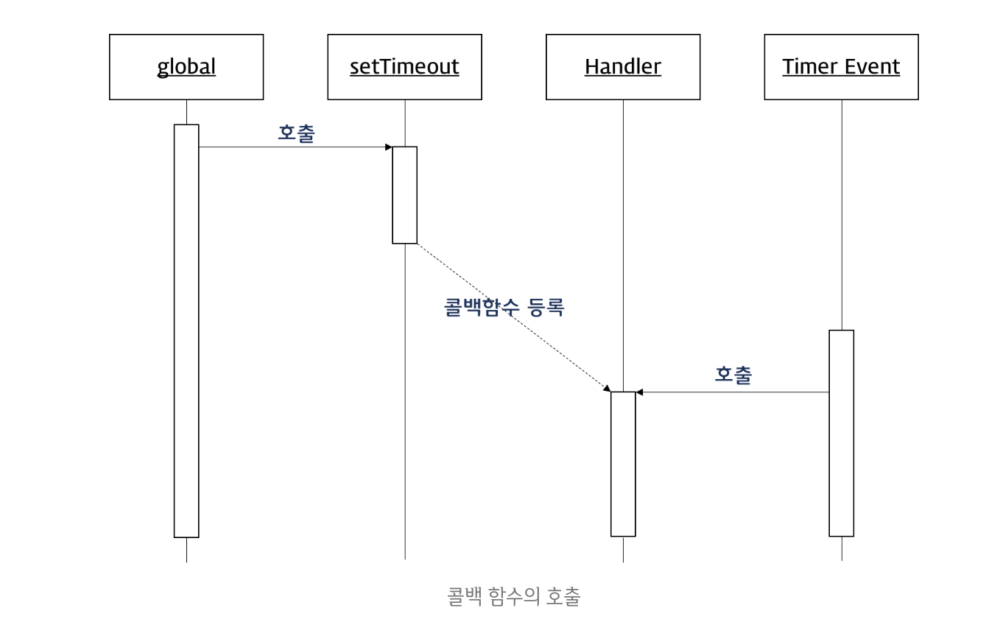

# 10장_객체 리터럴
원시값은 변경불가능한 값이지만 객체 타입의 값, 즉 객체는 변경 가능한 값이다. 
객체는 -개 이상의 프로퍼티로 구성된 집합이며, 프로퍼티는 키와 값으로 구성된다.


- 프로퍼티 : 객체의 상태를 나타내는 값
- 메셔드 : 프로퍼티를 참조하고 조작할 수 있는 동작

## 객체 리터럴에 의한 객체 생성
자바와 같은 클래스 기반 객체 지향 언어는 클래스를 사전에 정의하고 필요한 시점에 new 연산자를 사용하여 인스턴스를 생성하는 방식으로 객체를 생성한다. 하지만 자바스크립트는 프로토타입 기반 객체 지향 언어로서 클래스라는 개념이 없고 별도의 객체 생성 방법이 존재한다.

객체 리터럴에 의한 객체 생성은 가장 일반적인 자바스크립트의 객체 생성 방식이다. 객체 리터럴은 중괄호({...}) 내에 0개 이사의 프로퍼티를 정의한다. 변수에 할당되는 시점에 자바스크립트 엔진은 객체 리터럴을 해석해 객체를 생성한다.

```js
var emptyObject = {};
console.log(typeof emptyObject); // object

var person = {
  name: 'Lee',
  gender: 'male',
  sayHello: function () {
    console.log('Hi! My name is ' + this.name);
  }
};

console.log(typeof person); // object
console.log(person); // {name: "Lee", gender: "male", sayHello: ƒ}

person.sayHello(); // Hi! My name is Lee
```

객체 리터럴은 값으로 평가되는 표현식이기 때문에 객체 리터럴의 닫는 중괄호 뒤에는 세미콜론을 붙인다.
자바스크립트에서 객체생성을 하기 위해서는 클래스를 정의하고 new 연산자와 함께 생성자를 호출할 필요가 없고 숫자나 문자열을 만드는 것처럼 리터럴로 객체를 생성한다.

### 프로퍼티
프로퍼티는 프로퍼티 키(이름)와 프로퍼티 값으로 구성된다. 프로퍼티는 프로퍼티 키로 유일하게 식별할 수 있다. 즉, 프로퍼티 키는 프로퍼티를 식별하기 위한 식별자(identifier)다. 프로퍼티 키의 명명 규칙과 프로퍼티 값으로 사용할 수 있는 값은 아래와 같다.

- 프로퍼티 키 : 빈 문자열을 포함하는 모든 문자열 또는 symbol 값
- 프로퍼티 값 : 모든 값

프로퍼티 키에 문자열이나 symbol 값 이외의 값을 지정하면 암묵적으로 타입이 변환되어 문자열이 된다. 이미 존재하는 프로퍼티 키를 중복 선언하면 나중에 선언한 프로퍼티가 먼저 선언한 프로퍼티를 덮어쓴다. 배열과는 달리 객체는 프로퍼티를 열거할 때 순서를 보장하지 않는다.

### 메서드
자바스크립트에서 사용할 수 있는 모든 값은 프로퍼티 값으로 사용할 수 있다. 함수는 값으로 취급할 수 있기 때문에 프로퍼티 값으로 사용할 수 있다. 프로퍼티 값이 함수일 경우 일만 함수와 구분하기 위해 메서드라고 부른다. 즉 메서드는 객체에 묶여있는 함수를 의미한다
```js
var circle = {
  radius: 5,

  getDiameter: function () {
    return 2 * this.radius; //this 는 circle dlek
  }
};

console.log(circle.getDiameter());
```

### 프로퍼티 접근
프로퍼티에 접근하는 방법은 두가지이다. 
1. 마침표 프로퍼티 접근 연사자(.)를 사용하는 마침표 표기법
2. 대괄호 프로퍼티 접근연산자([...])를 사용하는 대괄호 표기법
  - 대괄호([]) 표기법을 사용하는 경우, 대괄호 내에 들어가는 프로퍼티 이름은 반드시 문자열이어야 한다.

```js
var person = {
  'first-name': 'Ung-mo',
  'last-name': 'Lee',
  gender: 'male',
};

// 마침표 포기법에 의한 프로퍼티 접근
console.log(person.age); // undefined

// 대괄호 표기법에 의한 프로퍼티 접근
console.log(person['name']);
```

객체에 존재하지 않는 프로퍼티에 접근하면 undefined 를 반환한다.
```js
var person = {
  name: 'Lee'
}

console.log(person.age);//undefined
```

### 프로퍼티 값 갱신
이미 존재하는 프로퍼티에 값을 할당하면 프로퍼티 값이 갱신된다.

```js
var person = {
  'first-name': 'Ung-mo',
  'last-name': 'Lee',
  gender: 'male',
};

person['first-name'] = 'Kim';
console.log(person['first-name'] ); // 'Kim'
```

### 프로퍼티 동적생성
객체가 소유하고 있지 않은 프로퍼티 키에 값을 할당하면 하면 주어진 키와 값으로 프로퍼티를 생성하여 객체에 추가한다.
```js
var person = {
  'first-name': 'Ung-mo',
  'last-name': 'Lee',
  gender: 'male',
};

person.age = 20;
console.log(person.age); // 20
```
### 프로퍼티 삭제
delete 연산자를 사용하면 객체의 프로퍼티를 삭제할 수 있다. 이때 피연산자는 프로퍼티 키이어야 한다.
```js
var person = {
  'first-name': 'Ung-mo',
  'last-name': 'Lee',
  gender: 'male',
};

delete person.gender;
console.log(person.gender); // undefined

delete person;
console.log(person); // Object {first-name: 'Ung-mo', last-name: 'Lee'}
```


<hr>

# 12장_함수

## 함수
프로그래밍 언어의 함수는 일련의 과정을 문으로 구현하고 코드블록으로 감싸서 하나의 실행 단위로 정의한 것이다. 


- 함수 내부로 입력을 전달받는 변수를 매개변수, 입력을 인수, 출력을 반환값이라 한다.
- 함수는 값이며, 여러개 존재할 수 있으므로 식별자인 함수 이름을 사용할 수 있다.


## 함수 리터럴
#### 리터럴 : 사람이 이해할 수 있는 문자 또는 약속된 기호를 사용해 값을 생성하는 표기방식. 

즉 리터럴은 **값을 생성하기 위한 표기법**아다. 따라서 함수 리터럴도 평가되어 값을 생성하며 이 값은 객체다. (=함수는 객체다) 함수는 객체지만 일반객체와는 다르다. 일반 객체는 호출할 수 없지만 함수는 호출할 수 있다. 그리고 일반 객체에는 없는 함수 객체만의 고유한 프로퍼티를 갖는다. 

함수리터럴은 function 키워드, 함수이름, 매개변수목록, 함수몸체로 구성된다.

- 함수이름
  - 함수 이름은 함수 몸체 내에서만 참조할 수 있는 식별자다
- 매개변수 목록
  - 각 매개변수에는 함수를 호출할 때 지정한 인수가 순서대로 할당되기때문에 매개변수 목록은 순서에 의미가 있다.
  - 매개변수는 함수 몸체 내에서 변수와 동일하게 취급된다.
- 함수 몸체
  - 함수가 호출되었을 때 일괄적으로 실행될 문들을 하나의 실행단위로 정의한 코드블록이다.
  - 함수 몸체는 함수 호출에 의해 실행된다. 


## 함수 정의
정의된 함수는 자바스크립트 엔진에 의해 평가되어 함수 객체가 된다.

### 함수 선언문
```js
function add(x, y){
  return x + y;
}

console.dir(add);
```
- 함수선언문은 함수 이름을 생략할 수 없다. 
- 함수선언문은 표현식이 아닌 문이다. 따라서 변수에 할당할 수 없다.

```js
var add = function add(x, y){
  return x + y;
};

console.log(add(2,5)); //7
```
그러나 위 식에서 마치 함수를 변수에 할당할 수 있는 것처럼 보인다. 그 이유는 자바스크립트 엔진이 코드의 문맥에 따라 아래 2가지 방법으로 코드를 해석하기 때문이다. 
- 동일한 함수 리터럴을 표현식이 아닌 문인 함수 선언문으로 해석
- 표현식인 문인 함수 리터럴 표현식으로 해석

#### => 함수 몸체 내에서만 참조할 수 있는 식별자 란 ?
함수 몸체 외부에서는 함수 이름으로 함수를 참조할 수 없으므로 함수 몸체 외부에서는 함수 이름으로 함수를 호출할 수 없다는 의미이다. 즉, 함수를 가리키는 식별자가 없다는 것과 마찬가지이다.

```js
function foo() { console.log('foo'); }
foo(); // foo
```
기명 함수 리터럴을 단독으로 사용하면 함수 선언문으로 해석된다.

```js
(function bar() { console.log('bar'); });
bar(); // ReferenceError : bar is not defined
```
함수 리터럴을 피연산자로 사용하면 함수 선언문이 아니라 함수 리터럴 표현식으로 해석된다.
그룹 연산자 () 내에 있는 함수리터럴(bar)은 함수 선언문으로 해석되지 않고 함수 리터럴 표현식으로 해석된다.

이렇듯 이름이 있는 기명함수 리터럴은 코드의 문맥에 따라 함수 선언문 또는 함수 리터럴 표현식으로 해석된다.

함수 몸체 내에서만 함수를 참조할 수 있다고 했는데 그럼 foo() 는 어떻게 호출할 수 있었던걸까
foo 라는 이름으로 함수를 호출하면 foo 는 함수 이름이 아니라 함수 객체를 가리키는 식별자여야 한다. 식별자 foo 를 선언한적도 할당한 적도 없는데 foo는 무엇일까 ? foo는 자바스크립트 엔진이 암묵적으로 생성한 식별자이다. 

자바스크립트 엔진은
1. 함수 선언문을 해석해 함수 객체를 생성한다. 
2. 생성된 함수를 호출하기 위해 함수 이름과 동일한 이름의 식별자를 암묵적으로 생성하고
3. 거기에 함수 객체를 할당한다. 

결과적으로 함수는 함수 이름으로 호출하는 것이 아니라 함수 객체를 가리키는 식별자로 호출한다


### 함수 표현식
자바스크립트의 함수는 객체 타입의 값으로 값처럶 변수에 할당할 수도 있고 프로퍼티 값이 될 수도 있으며 배열의 요소가 될 수도 있다. 함수는 일급 객체이므로 함수리터럴로 생성한 함수객체를 변수에 할당할 수 있는데 이를 함수 표현식이라 한다.

```js
var add = function (x, y){
  return x + y;
}

console.log(add(2,5));
```

함수 선언문은 표현식이 아닌 문 이고 함수 표현식은 표현식인 문이다.

### 함수 생성시점과 함수 호이스팅
```js
var res = square(5);

function square(number) {
  return number * number;
}
```
위 코드를 보면 함수 선언문으로 함수가 정의되기 이전에 함수 호출이 가능하다. 함수 선언문의 경우, 함수 선언의 위치와는 상관없이 코드 내 어느 곳에서든지 호출이 가능한데 이것을 함수 호이스팅(Function Hoisting)이라 한다.

그러나 함수 표현식으로 정의한 함수는 함수 표현식 이전에 호출할 수 없다. 이는 함수 선언문으로 정의한 함수와 함수 표현식으로 정의한 함수의 생성 시점이 다르기 때문이다.

* 함수 선언문 
  - 런타임 이전에 함수 객체가 먼저 생성됨
  - 함수 이름과 동일한 이름의 식별자를 암묵적으로 생성하고 생성된 함수 객체를 할당한다.
  - 런타임에는 이미 위 과정이 모두 완료된 상태
  - 따라서 함수 선언문 이전에 함수를 참조할 수 있는것
  - 이런 특징을 함수 호이스팅이라고 한다.

<br>

* 함수 표현식
  - 변수에 할당되는 값이 함수 리터럴인 문
  - 변수 할당문의 값은 할당문이 실행되는 시점 즉 런타임에 평가된다
  - 함수 표현식의 함수 리터럴도 할당문이 실행되는 시점에 평가되어 함수 객체가 된다.
  - 함수 표현식으로 함수를 정의하면 함수 호이스팅이 발생하는 것이 아니라 변수 호이스팅이 발생함
  - 함수 표현식으로 정의된 함수를 런타임 이전에 호출하면 undefined 로 평가됨

<br>

* 함수 호이스팅과 변수 호이스팅
  - 변수는 undefined 로 초기화된다. 따라서 변수 선언문 이전에 변수를 참조하면 undefined 로 평가됨
  - 함수선언문을 통해 생성된 식별자는 함수 객체로 초기화 된다. 따라서 함수 선언문 이전에 호출하면 함수 호이스팅에 의해 호출이 가능함


### Function 생성자 함수
Function 생성자 함수에 매개변수 목록과 함수 몸체를 문자열로 전달하면서 new 연산자와 함께 호출하면 함수 객체를 생성해서 반환한다.

```js
var add = new Function('x', 'y', 'return x + y');
```
Function 생성자 함수로 함수를 생성하는 방식은 바람직하지 않다. 

### 화살표 함수
화살표를 사용해 좀 더 간략한 방법으로 함수를 선언할 수 있다. **화살표 함수는 항상 익명 함수로 정의한다.**

```js
const add = (x,y) => x+y;
console.log(add(2,5));
```


## 함수 호출
함수 호출은 표현식이다. 따라서 함수 호출은 반환값으로 평가된다.
```js
function multiply(x, y){
  return x * y;
}

//함수 호출은 반환값으로 평가된다.
var result = multiply(3, 5);
console.log(result); //15
```


함수는 매개변수의 개수와 인수의 개수가 일치하는지 체크하지 않는다. 인수가 부족해서 인수가 할당되지 않은 매개변수의 값은 undefined 이다.
매개변수보다 인수가 더 많은 경우 초과된 인수는 무시된다.

ES6 에서 도입된 매개변수의 기본값을 사용하면 함수 내에서 수행하던 인수 체크 및 초기화를 간소화할 수 있다.
```js
function add(a=0, b=0, c=0){
  return a+b+c;
}
```
기본값은 매개변수에 인수를 전달하지 않았을 경우와 undefined 를 전달한 경우에만 유효하다.

### 반환문
함수는 return 키워드와 표현식(반환값)으로 이뤄진 반환문을 사용해 실행 결과를 함수 외부로 반환할 수 있다. 함수 호출 표현식은 return 키워드가 반환한 반환값으로 평가된다.

#### 반환문의 역할
1. 반한문은 함수의 실행을 중단하고 함수 몸체를 빠져나간다. 
```js
function multiply(x,y){
  return x * y; //반환문
  console.log('실해오디지 않는다');
}

console.log(multiply(3,5)); //15
```

2. 반환문은 return 키워드 뒤에 오는 표현식을 평가해 반환한다.
return 키워드 뒤에 반환값으로 표현식을 명시적으로 지정하지 않으면 Undefined 가 반환된다.
```js
function foo(){
  return;
}

console.log(foo()); //undefined
```

## 참조에 의한 전달과 외부 상태의 변경

### Call-by-reference
객체형(참조형) 인수는 Call-by-reference(참조에 의한 호출)로 동작한다. 이는 함수 호출 시 참조 타입 인수를 함수에 매개변수로 전달할 때 매개변수에 값이 복사되지 않고 객체의 참조값이 매개변수에 저장되어 함수로 전달되는 방식이다. 이때 함수 내에서 매개변수의 참조값이 이용하여 객체의 값을 변경했을 때 전달되어진 참조형의 인수값도 같이 변경된다.
```js
function changeVal(primitive, obj) {
  primitive += 100;
  obj.name = 'Kim';
  obj.gender = 'female';
}

var num = 100;
var obj = {
  name: 'Lee',
  gender: 'male'
};

console.log(num); // 100
console.log(obj); // Object {name: 'Lee', gender: 'male'}

changeVal(num, obj);

console.log(num); // 100
console.log(obj); // Object {name: 'Kim', gender: 'female'}
```
###  Call-by-value
원시 타입 인수는 Call-by-value(값에 의한 호출)로 동작한다. 이는 함수 호출 시 원시 타입 인수를 함수에 매개변수로 전달할 때 매개변수에 값을 복사하여 함수로 전달하는 방식이다. 이때 함수 내에서 매개변수를 통해 값이 변경되어도 전달이 완료된 원시 타입 값은 변경되지 않는다.

```js
function foo(primitive) {
  primitive += 1;
  return primitive;
}

var x = 0;

console.log(foo(x)); // 1
console.log(x);      // 0
```

이렇게 함수가 외부상태를 변경하면 상태 변화를 추적하기 어려워진다. 이런 현상은 객체가 변경할 수 있는 값이고, 참조에 의한 전달방식(Call-by-reference)으로 동작하기 때문에 발생하는 부작용이다. 해결방법중 하나는 객체를 불변객체로 만들어 사용하는 것이다 (객체의 복사본 생성). 객체를 마치 원시값처럼 변경 불가능한 값으로 동작하게 만드는 것이다.

* 아래는 불변 객체를 만드는 간단한 예시이다.
```js
let user = {
  name: "const",
  gender: "male"
};

function copyObject(target) {
  let result = {};
  for(let prop in target) {
    result[prop] = target[prop];
  }
  return result;
}

let user2 = copyObject(user);
user2.name = 'epitone';

if (user !== user2) {
  console.log("유저 정보가 변경되었습니다.");
}

console.log(user.name, user2.name); // const epitone
console.log(user === user2); // false
```

## 다양한 함수의 형태
### 즉시실행함수
함수 정의와 동시에 즉시 호출되는 함수를 즉시실행함수 라고한다. 즉시 실행 함수는 단 한번만 호출되며 다시 호출할 수 없다.

```js
(function(){
  var a = 3;
  var b = 5;
  return a * b;
}());
```

### 재귀함수
함수가 자기 자신을 호출하는 것을 재귀호출이라 한다. 재귀 함수는 자기 자신을 호출하는 행위를 하는 함수를 말한다.
재귀 함수는 반복되는 처리를 위해 사용된다.

```js
// 피보나치 수열
// 피보나치 수는 0과 1로 시작하며, 다음 피보나치 수는 바로 앞의 두 피보나치 수의 합이 된다.
// 0, 1, 1, 2, 3, 5, 8, 13, 21, 34, 55, 89, 144, 233, 377, 610, ...
function fibonacci(n) {
  if (n < 2) return n;
  return fibonacci(n - 1) + fibonacci(n - 2);
}

console.log(fibonacci(0)); // 0
console.log(fibonacci(1)); // 1
console.log(fibonacci(2)); // 1
console.log(fibonacci(3)); // 2
console.log(fibonacci(4)); // 3
console.log(fibonacci(5)); // 5
console.log(fibonacci(6)); // 8

// 팩토리얼
// 팩토리얼(계승)은 1부터 자신까지의 모든 양의 정수의 곱이다.
// n! = 1 * 2 * ... * (n-1) * n
function factorial(n) {
  if (n < 2) return 1;

  //재귀호출
  return factorial(n - 1) * n; 
}

console.log(factorial(0)); // 1
console.log(factorial(1)); // 1
console.log(factorial(2)); // 2
console.log(factorial(3)); // 6
console.log(factorial(4)); // 24
console.log(factorial(5)); // 120
console.log(factorial(6)); // 720
```
이때 facorial 함수 내부에서 자기 자신을 호출할 때 사용한 식별자 facorial 은 함수 이름이다. 

재귀 함수는 자신을 무한히 연쇄 호출하므로 호출을 멈출 수 있는 탈출 조건을 반드시 만들어야 한다. factorial 예제의 경우 인수가 1 이하일 때 재귀 호출을 멈춘다. 탈출 조건이 없는 경우, 함수가 무한 호출되어 stackoverflow 에러가 발생한다. 위의 두개의 예제 모두 조건식을 통해 재귀 호출을 중지하고 있다.


## 콜백 함수
콜백 함수(Callback function)는 함수를 명시적으로 호출하는 방식이 아니라 특정 이벤트가 발생했을 때 시스템에 의해 호출되는 함수를 말한다. 콜백 함수가 자주 사용되는 대표적인 예는 이벤트 핸들러 처리이다.

```html
<!DOCTYPE html>
<html>
<body>
  <button id="myButton">Click me</button>
  <script>
    var button = document.getElementById('myButton');
    button.addEventListener('click', function() {
      console.log('button clicked!');
    });
  </script>
</body>
</html>
```
Javascript의 함수는 일급객체라서 Javascript의 함수는 변수와 같이 사용될 수 있다.
콜백 함수는 매개변수를 통해 전달되고 전달받은 함수의 내부에서 어느 특정시점에 실행된다.
setTimeout()의 콜백 함수를 살펴보자. 두번째 매개변수에 전달된 시간이 경과되면 첫번째 매개변수에 전달한 콜백 함수가 호출된다.
```js
setTimeout(function () {
  console.log('1초 후 출력된다.');
}, 1000);
```



콜백 함수는 주로 비동기식 처리 모델(Asynchronous processing model)에 사용된다. 비동기식 처리 모델이란 처리가 종료하면 호출될 함수(콜백함수)를 미리 매개변수에 전달하고 처리가 종료하면 콜백함수를 호출하는 것이다. 콜백함수는 콜백 큐에 들어가 있다가 해당 이벤트가 발생하면 호출된다. 콜백 함수는 클로저이므로 콜백 큐에 단독으로 존재하다가 호출되어도 콜백함수를 전달받은 함수의 변수에 접근할 수 있다.

### 순수함수와 비순수함수
안함

<hr>

