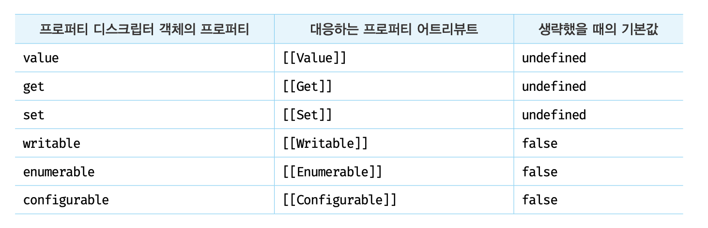
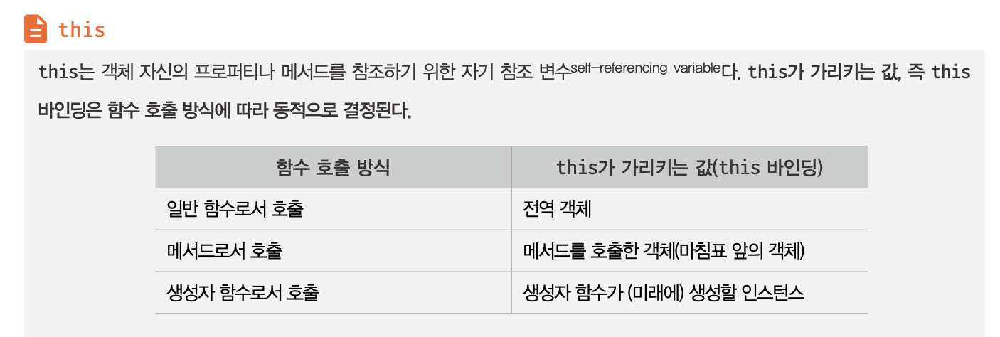

# 16장_프로퍼티 어트리뷰트

## 내부슬롯과 내부메서드
내부슬롯과 내부메서드는 자바스크립트 엔진의 내부 로직으로, 
자바스크립트는 내부슬롯과 내부메서드에 직접적으로 접근하거나 호출할 수 있는 방법을 제공하진않는다.

단, 일부 내부 슬롯과 내 메서드에 한하여 간접적으로 접근할 수 있는 수단을 제공하기는 한다.

```js
const o = {};

o.[[Prototype]] // 내부 슬롯은 자바스크립트 내부 로직이므로 직접 접근할 수 없다

o.__proto__ // Object.prototype
```

- 예를들어 [[Prototype]] 내부슬롯은 __proto__ 를 통해 간접적으로 접근할 수 있다.

## 프로퍼티 어트리뷰트와 프로퍼티 디스크립터 객체
자바스크립트 엔진은 프로퍼티를 생성할 때 프로퍼티의 상태를 나타내는 프로퍼티 어트리뷰트를 기본값으로 자동정의한다.

#### 프로퍼티의 상태
- 프로퍼티의 값 : value
- 값의 갱신 가능 여부 : writable
- 열거 가능 여부 : enumerable
- 재정의 가능 여부 : configurable

#### 프로퍼티 어트리뷰트란 ? 
자바스크립트 엔진이 관리하는 내부 상태 값인 내부슬롯 [[value]],[[writable]],[[enumerable]],[[configurable]] 이다.

내부슬롯은 자바스크립트 내부 로직이므로 직접 접근할 수 없지만, **Object.getOwnPropertyDescriptor** 메서드를 사용해 간접적으로 확인할 수 있다.

```js
const person = {
  name: 'Lee'
};

console.log(Object.getOwnPropertyDescriptor(person,'name'));
//{value: "Lee", writable: true, enumerable: true, configurable: true}
```
- Object.getOwnPropertyDescriptor(person,'name')
  - 첫번째 매개변수 : 객체의 참조
  - 두번째 매개변수 : 프로퍼티 키를 문자열로 전달
  - return : 프로퍼티 디스크립터 객체 
    - 프로퍼티 디스크립터 객체는 프로퍼티 어트리뷰트 정보를 제공한다.

## 프로퍼티 정의
프로퍼티 정의는 새로운 프로퍼티를 추가하면서 프로퍼티 어트리뷰트를 명시적으로 정의하거나, 기존 프로퍼티 어트리뷰트를 재정의하는 것을 말한다.

1. 프로퍼티 값을 갱신 가능하도록 할 것인지
2. 프로퍼티를 열거 가능하도록 할 것인지
3. 프로퍼티를 재정의 가능하도록 할 것인지

정의할 수 있다.

### 프로퍼티 어트리뷰트 정의
- Object.defineProperty 를 사용해 프로퍼트의 어트리뷰트를 정의할 수 있다. -> 한번에 하나의 프로퍼티만 정의할 수 있음
- Object.defineProperties 메서드를 사용하면 여러개의 프로퍼티를 한번에 정의할 수 있다.
```js
const person = {};

Object.defineProperty(person, 'firstName', {
  value: 'Ungmo',
  writable: true,
  enumerable: true,
  configurable: true
});

let descriptor = Object.getOwnPropertyDescriptor(person, 'fistName');
console.log('firstName', descriptor);
//firstName {value: "Ungmo", writable: true, enumerable: true, configurable: true}
...
```

- 디스크립터 객체의 프로퍼티를 누락시키면 undefined, false 가 기본값이다.

#### 접근자 프로퍼티
- 객체의 접근자 프로퍼티에 값을 할당을 하면 setter함수가 작동을하고
- 호출을 하면 (참조) getter함수가 작동을 합니다

## 객체 변경 방지
객체는 **변경가능한 값**이므로 재할당 없이 직접 변경할 수 있다.
- 프로퍼티를 추가하거나 삭제할 수 있고
- 프로퍼티 값을 갱신할 수 있으며
- Object.defineProperty 또는 Object.defineProperties 메서드를 사용해 프로퍼티 어트리뷰트를 재정의 할 수도 있다.

### 객체 확장 금지
#### Object.preventExtensions
Object.preventExtensions 메서드는 프로퍼티 추가를 금지한다.
```js
const person = { name: 'Lee' }

Object.preventExtensions(person);

console.log(Object.isExtensible(person)); //false
```

### 객체 밀봉
#### Object.seal
Object.seal 메서드는 객체를 밀봉하여 읽기와 쓰기만 가능하도록 한다.
프로퍼티 추가, 삭제, 재정의(Object.defineProperty())가 금지되며 프로퍼티 값 갱신은 가능하다.


```js
const person = { name: 'Lee' }

console.log(Object.isSealed(person)); //false

Object.seal(person);

console.log(Object.isSealed(person)); //true
```
밀봉(seal)된 객체는 configurable 이 false 다.

### 객체 동결
#### Object.freeze 메서드는 객체를 동결하여 읽기만 가능하게 한다.
```js
const person = { name: 'Lee' }

console.log(Object.isFrozen(person)); //false

Object.freeze(person);

console.log(Object.isFrozen(person)); //true
```

동결이 된 객체는 writable 과 configurable 이 false 이다.

### 불변객체.
위에서 알아본 변경 방지 메서드들은 얕은 변경 방지로, 직속 프로퍼티만 변경이 방지되고 중첩객체까지는 영향을 주지는 못한다. **ex)** Object.freeze 메서드로 객체를 동결해도 중첩객체까지 동결할 수 없다.
```js
const person = {
   name: 'Lee',
   address: { city: 'Seoul' }
};

Object.freeze(person); //얕은 객체 동결 

console.log(Object.isFrozen(person)); //true
console.log(Object.isFrozen(person.address)); //false

```

객체의 중첩 객체까지 변경이 불가능한 읽기 전용의 불변객체를 구현하려면 객체를 값으로 갖는 모든 프로퍼티에 대해 재귀적으로 Object.freeze 메서드를 호출해야 한다.
```js
function deepFreeze(target){

  if(target && typeof target === 'Object' && !Object.isFrozen(target)){
    Object.freeze(target);
  //모든 프로퍼티를 순회하며 재귀적으로 동결한다.
  //Object.keys 메서드는 객체 자신의 열거 가능한 프로퍼티 키를 배열로 반환한다.
  //forEach 메서드는 배열을 순회하며 배열의 각 요소에 대하여 콜백함수를 실행한다.
  Object.keys(target).forEach(key => deepFreeze(target[key]));
  }
  return target;
}

deepFreeze(person);

console.log(Object.isFrozen(person.address)); //true
```


# 17장_생성자 함수의 의한 객체 생성

객체리터럴에 의한 객체 생성 방식은 가장 일반적이고 간단한 객체 생성 방식이다. 객체는 객체 리터럴 이외에도 다양한 방으로 생성할 수 있다. 객체 리터럴을 사용해 객체를 생성하는 방식과 생성자 함수를 사용하여 객체를 생성하는 방식과의 장단점을 살펴본다.

## Object 생성자 함수

new 연산자와 함께 Object 생성자 함수를 호출하면 빈 객체를 생성하여 반환한다.
```js
const person = new Object();

person.name = 'Lee';
person.sayHello = function () {
  console.log('Hi! My name is ' + this.name);
};

console.log(person); //{name : "Lee", sayHello: f}
person.sayHello(); //Hi! My name is Lee
```

#### 생성자 함수란 ?
new 연산자와 함께 호출해 인스턴스를 생성하는 함수. (생성자 함수에 의해 생성된 객체를 인스턴스 라고 한다.)

#### Object 생성자 함수를 사용해서 객체를 생성하는 방식은 특별한 이유가 없다면 유용해 보이지 않는다.

## 생성자 함수
### 객체 리터럴에 의한 객체 생성 방식의 문제점

장점 : 직관적이고 간편하다
단점 : 객체 리터럴에 의한 객체 생성 방식은 단 하나의 객체만 생성한다. 객체 리터럴 방식과 Object 생성자 함수 방식으로 객체를 생성하는 것은 프로퍼티 값만 다른 여러 개의 객체를 생성할 때 불편하다. 동일한 프로퍼티를 갖는 객체임에도 불구하고 매번 같은 프로퍼티를 기술해야 한다.
```js
var person1 = {
  name: 'Lee',
  gender: 'male',
  sayHello: function () {
    console.log('Hi! My name is ' + this.name);
  }
};

var person2 = {
  name: 'Kim',
  gender: 'female',
  sayHello: function () {
    console.log('Hi! My name is ' + this.name);
  }
};
```

생성자 함수를 사용하면 마치 객체를 생성하기 위한 템플릿(클래스)처럼 사용하여 프로퍼티가 동일한 객체 여러 개를 간편하게 생성할 수 있다.
```js
// 생성자 함수
function Person(name, gender) {
  this.name = name;
  this.gender = gender;
  this.sayHello = function(){
    console.log('Hi! My name is ' + this.name);
  };
}

// 인스턴스의 생성
var person1 = new Person('Lee', 'male');
var person2 = new Person('Kim', 'female');

console.log('person1: ', typeof person1);
console.log('person2: ', typeof person2);
console.log('person1: ', person1);
console.log('person2: ', person2);

person1.sayHello();
person2.sayHello();
```


- 생성자 함수 이름은 일반적으로 대문자로 시작한다. 이것은 생성자 함수임을 인식하도록 도움을 준다.
- 프로퍼티 또는 메소드명 앞에 기술한 this는 생성자 함수가 생성할 인스턴스(instance)를 가리킨다.
- this에 연결(바인딩)되어 있는 프로퍼티와 메소드는 public(외부에서 참조 가능)하다.
- 생성자 함수 내에서 선언된 일반 변수는 private(외부에서 참조 불가능)하다. 즉, 생성자 함수 내부에서는 자유롭게 접근이 가능하나 외부에서 접근할 수 없다.
```js
function Person(name, gender) {
  var married = true;         // private
  this.name = name;           // public
  this.gender = gender;       // public
  this.sayHello = function(){ // public
    console.log('Hi! My name is ' + this.name);
  };
}

var person = new Person('Lee', 'male');

console.log(typeof person); // object
console.log(person); // Person { name: 'Lee', gender: 'male', sayHello: [Function] }

console.log(person.gender);  // 'male'
console.log(person.married); // undefined
```

자바스크립트의 생성자 함수는 이름 그대로 객체를 생성하는 함수이다. 하지만 자바와 같은 클래스 기반 객체지향 언어의 생성자(constructor)와는 다르게 그 형식이 정해져 있는 것이 아니라 기존 함수와 동일한 방법으로 생성자 함수를 선언하고 new 연산자를 붙여서 호출하면 해당 함수는 생성자 함수로 동작한다.

```js
//new 연산자와 함께 호출하지 않으면 생성자 함수로 동작하지 않는다=일반 함수로서 호출된다
const circle3 = Circle(15);

//일반 함수로서 호출된 Circle 은 반환문이 없으므로 암묵적으로 undefined 를 반환한다.
console.log(circle3); //undefined

//일반 함수로서 호출된 Circle 내의 this 는 전역 객체를 가리킨다.
console.log(radius); //15
```

이는 생성자 함수가 아닌 일반 함수에 new 연산자를 붙여 호출하면 생성자 함수처럼 동작할 수 있다는 것을 의미한다. 따라서 일반적으로 생성자 함수명은 첫문자를 대문자로 기술하여 혼란을 방지하려는 노력을 한다.

new 연산자와 함께 함수를 호출하면 this 바인딩이 다르게 동작한다.


### 생성자 함수의 인스턴스 생성과정
#### 생성자 함수의 역할
프로퍼티 구조가 동일한 이슨턴스를 생성하기 위한 템플릿 으로서의 역할.
1. 인스턴스를 생성
2. 생성된 인스턴스를 초기화

```js
//생성자 함수
function Circle(radius){
  //인스턴스 초기화
  this.radius = radius;
  this.getDiameter = function(){
    return 2 * this.radius;
  }l
}

//인스턴스 생성
const circle = new Circle(5); // 반지름이 5인 Circle 객체를 생성
```
인스턴스를 생성하고 반환하는 코드는 보이지 않지만, 자바스크립트 엔진은 암묵적이 처리를 통해 인스턴스를 생성하고 반환한다. new 연산자와 함께 생성자 함수를 호출하면 자바스크립트엔진은 다음과 같은 과정을 거친다.

#### 1. 인스턴스 생성과 this 바인딩
암묵적으로 빈 객체가 생성되며 이때 생성된 인스턴스는 this 에 바인딩 된다. 이는 런타임 이전에 실행된다. 따라서 생성자 함수 내의 this 는 그 함수가 생성할 인스턴스를 가리킨다.

#### 바인딩
바인딩이란 식별자와 값을 연결하는 과정을 의미한다. 예를 들어 변수 선언은 변수 이름과 확보된 메모리 공간의 주소를 바인딩 하는 것이다.

```js
function Circle(radius){
  console.log(this); //Circle{}

  this.radius = radius;
  this.getDiameter = function(){
    return 2 * this.radius;
  }
}
```

#### 2. 인스턴스 초기화
this 에 바인딩 되어있는 인스턴스에 프로퍼티나 메서드를 추가하고 생성자 함수가 인수로 전달받은 초기값을 인스턴스 프로퍼티에 할당하여 초기화하거나고정값을 할당한다.
```js
function Circle(radius){
  this.radius = radius;
  this.getDiameter = function(){
    return 2 * this.radius;
  }
}
```

#### 3. 인스턴스 반환
생성자 함수 내부의 모든 처리가 끝나면 완성된 인스턴스가 바인딩된 this 가 암묵적으로 반환된다.
```js
function Circle(radius){
  this.radius = radius;
  this.getDiameter = function(){
    return 2 * this.radius;
  };
  //완성된 인스턴스가 바인딩된 this 가 암묵적으로 반환된다.
}

//인스턴스 생성.Circle 생성자 함수는 암묵적으로 this 를 반환한다.
const circle = new Circle(1);
console.log(circle) //Circle {radius:1. getDiameter: f}
```

만약 this 가 아닌 다른 객체를 명시적으로 반환하면 this 가 반환되지 못하고 return 문에 명시한 객체가 반환된다. 이렇게 생성자 함수 내부에서 명시적으로 this 가 아닌 다른 값을 반환하는 것은 생성자 함수의 기본 동작을 훼손한다. 따라서 생성자 함수 내부에서 return 문을 반드시 생략해야한다.

### 내부메서드 [[Call]] 과 [[Construct]]

함수는 객체 이므로 일반 객체가 가지고 있는 내부슬롯과 내부 메서드를 모두 가지고 있다.
함수는 객체이지만 일반 객체와는 다르다.
1. 일반 객체는 호출할 수 없지만 함수는 호출할 수 있다.
2. 햠수 객체는 일반 객체가 가지고 있는 내부 슬롯과 내부 메서드를 포함하여 [[Call]] 과 [[Construct]] 같은 내부 메서드를 추가로 가지고 있다.

함수가 일반 함수로서 호출되면 함수 객체의 내부 메서드 [[Call]] 이 호출되고 new 연산자와 함께 생성자 함수로서 호출되면 내부 메서드 [[Construct]]가 호출된다.


...후략...

# 18장_일급객체

일급 객체(first-class object)란 생성, 대입, 연산, 인자 또는 반환값으로서의 전달 등 프로그래밍 언어의 기본적 조작을 제한없이 사용할 수 있는 대상을 의미한다.

다음 조건을 만족하면 일급 객체로 간주한다.

1. 무명의 리터럴로 표현이 가능하다.
2. 변수나 자료 구조(객체, 배열 등)에 저장할 수 있다.
3. 함수의 매개변수에 전달할 수 있다.
4. 반환값으로 사용할 수 있다.
```js
// 1. 무명의 리터럴로 표현이 가능하다.
// 2. 변수나 자료 구조에 저장할 수 있다.
var increase = function (num) {
  return ++num;
};

var decrease = function (num) {
  return --num;
};

var predicates = { increase, decrease };

// 3. 함수의 매개변수에 전달할 수 있다.
// 4. 반환값으로 사용할 수 있다.
function makeCounter(predicate) {
  var num = 0;

  return function () {
    num = predicate(num);
    return num;
  };
}

var increaser = makeCounter(predicates.increase);
console.log(increaser()); // 1
console.log(increaser()); // 2

var decreaser = makeCounter(predicates.decrease);
console.log(decreaser()); // -1
console.log(decreaser()); // -2
```

Javascript의 함수는 위의 조건을 모두 만족하므로 Javascript의 함수는 일급객체이다. 따라서 Javascript의 함수는 흡사 변수와 같이 사용할 수 있으며 코드의 어디에서든지 정의할 수 있다.

함수가 일급 객체 라는 것은 함수를 객체와 동일하게 사용할 수 있다는 의미이다.객체는 값이므로 함수는 값과 동일하게 취급할 수 있다. 따라서 함수는 값을 사용할 수 있는 곳이라면 어디서든지 리터럴로 정의 할 수 있으며 런타임에 함수 객체로 쳥가된다.

#### 일급객체로서의 함수
일급 객체로서 함수가 가지는 가장 큰 특징은 일반 객체와 같이 함수의 매개변수에 전달할 수 있으며, 함수의 반환값으로 사용할 수도 있다는 것이다.

#### 함수 객체와 일반 객체의 차이점
함수와 다른 객체를 구분짓는 특징은 호출할 수 있다는 것이다. 그리고 함수 객체는 일반 객체에는 없는 함수 고유의 프로퍼티를 소유한다.

### 함수 객체의 프로퍼티
함수는 객체이기 때문에 프로퍼티를 가질 수 있다.

```js
function square(number) {
  return number * number;
}

square.x = 10;
square.y = 20;

console.log(square.x, square.y);
```

함수는 일반 객체와는 다른 함수만의 프로퍼티를 갖는다.
```js
function square(number) {
  return number * number;
}
console.dir(square);
```
#### arguments 프로퍼티
arguments 객체는 함수 호출 시 전달된 인수(argument)들의 정보를 담고 있는 순회가능한(iterable) 유사 배열 객체(array-like object)이며 함수 내부에서 지역변수처럼 사용된다. 즉, 함수 외부에서는 사용할 수 없다.

자바스크립트는 함수 호출 시 함수 정의에 따라 인수를 전달하지 않아도 에러가 발생하지 않는다.
```js
function multiply(x, y) {
  console.log(arguments);
  return x * y;
}

multiply();        // {}
multiply(1);       // { '0': 1 }
multiply(1, 2);    // { '0': 1, '1': 2 }
multiply(1, 2, 3); // { '0': 1, '1': 2, '2': 3 }

```
매개변수(parameter)는 인수(argument)로 초기화된다.

- 매개변수의 갯수보다 인수를 적게 전달했을 때(multiply(), multiply(1)) 인수가 전달되지 않은 매개변수는 undefined으로 초기화된다.
- 매개변수의 갯수보다 인수를 더 많이 전달한 경우, 초과된 인수는 무시된다.

이러한 자바스크립트의 특성때문에 런타임 시에 호출된 함수의 인자 갯수를 확인하고 이에 따라 동작을 달리 정의할 필요가 있을 수 있다. 이때 유용하게 사용되는 것이 arguments 객체이다.

arguments 객체는 매개변수 갯수가 확정되지 않은 가변 인자 함수를 구현할 때 유용하게 사용된다.

```js
function sum() {
  var res = 0;

  for (var i = 0; i < arguments.length; i++) {
    res += arguments[i];
  }

  return res;
}

console.log(sum());        // 0
console.log(sum(1, 2));    // 3
console.log(sum(1, 2, 3)); // 6
```

자바스크립트는 함수를 호출할 때 인수들과 함께 암묵적으로 arguments 객체가 함수 내부로 전달된다. arguments 객체는 배열의 형태로 인자값 정보를 담고 있지만 실제 배열이 아닌 유사배열객체(array-like object)이다.

유사배열객체란 length 프로퍼티를 가진 객체를 말한다. 유사배열객체는 배열이 아니므로 배열 메소드를 사용하는 경우 에러가 발생하게 된다. 따라서 배열 메소드를 사용하려면 Function.prototype.call, Function.prototype.apply를 사용하여야 하는 번거로움이 있다.


#### caller 프로퍼티
caller 프로퍼티는 자신을 호출한 함수를 의미한다.
```js
function foo(func) {
  var res = func();
  return res;
}

function bar() {
  return 'caller : ' + bar.caller;
}

console.log(foo(bar)); // caller : function foo(func) {...}
console.log(bar());    // null (browser에서의 실행 결과)
```

함수호출 foo(bar) 의 경우 bar 함수를 foo 함수 내에서 호출했다. 이때 bar 함수의 caller 프로퍼티는 bar 함수를 호출한 foo 함수를 가리킨다. 함수 호출 bar()의 경우 bar 함수를 호출한 함수는 없다. 따라서 caller 프로퍼티는 null을 가리킨다.

#### length 프로퍼티
length 프로퍼티는 함수 정의 시 작성된 매개변수 갯수를 의미한다.
```js
function foo() {}
console.log(foo.length); // 0

function bar(x) {
  return x;
}
console.log(bar.length); // 1

function baz(x, y) {
  return x * y;
}
console.log(baz.length); // 2
```
arguments.length의 값과는 다를 수 있으므로 주의하여야 한다. arguments.length는 함수 호출시 인자의 갯수이다.

#### name 프로퍼티
함수명을 나타낸다. 기명함수의 경우 함수명을 값으로 갖고 익명함수의 경우 빈문자열을 값으로 갖는다.
```js
// 기명 함수 표현식(named function expression)
var namedFunc = function multiply(a, b) {
  return a * b;
};
// 익명 함수 표현식(anonymous function expression)
var anonymousFunc = function(a, b) {
  return a * b;
};

console.log(namedFunc.name);     // multiply
console.log(anonymousFunc.name); // ''
```

####  __proto__ 접근자 프로퍼티
모든 객체는 [[Prototype]]이라는 내부 슬롯이 있다. [[Prototype]] 내부 슬롯은 프로토타입 객체를 가리킨다. 프로토타입 객체란 프로토타입 기반 객체 지향 프로그래밍의 근간을 이루는 객체로서 객체간의 상속(Inheritance)을 구현하기 위해 사용된다. 즉, 프로토타입 객체는 다른 객체에 공유 프로퍼티를 제공하는 객체를 말한다.

__proto__ 프로퍼티는 [[Prototype]] 내부 슬롯이 가리키는 프로토타입 객체에 접근하기 위해 사용하는 접근자 프로퍼티이다. 내부 슬롯에는 직접 접근할 수 없고 간접적인 접근 방법을 제공하는 경우에 한하여 접근할 수 있다. [[Prototype]] 내부 슬롯에도 직접 접근할 수 없으며 __proto__ 접근자 프로퍼티를 통해 간접적으로 프로토타입 객체에 접근할 수 있다.

```js
// __proto__ 접근자 프로퍼티를 통해 자신의 프로토타입 객체에 접근할 수 있다.
// 객체 리터럴로 셍성한 객체의 프로토타입 객체는 Object.prototype이다.
console.log({}.__proto__ === Object.prototype); // true
```
__proto__ 프로퍼티는 객체가 직접 소유하는 프로퍼티가 아니라 모든 객체의 프로토타입 객체인 Object.prototype 객체의 프로퍼티이다. 모든 객체는 상속을 통해 __proto__ 접근자 프로퍼티는 사용할 수 있다.

```js
// 객체는 __proto__ 프로퍼티를 소유하지 않는다.
console.log(Object.getOwnPropertyDescriptor({}, '__proto__'));
// undefined

// __proto__ 프로퍼티는 모든 객체의 프로토타입 객체인 Object.prototype의 접근자 프로퍼티이다.
console.log(Object.getOwnPropertyDescriptor(Object.prototype, '__proto__'));
// {get: ƒ, set: ƒ, enumerable: false, configurable: true}

// 모든 객체는 Object.prototype의 접근자 프로퍼티 __proto__를 상속받아 사용할 수 있다.
console.log({}.__proto__ === Object.prototype); // true
```

함수도 객체이므로 __proto__ 접근자 프로퍼티를 통해 프로토타입 객체에 접근할 수 있다.
```js
// 함수 객체의 프로토타입 객체는 Function.prototype이다.
console.log((function() {}).__proto__ === Function.prototype); // true
```

#### prototype 프로퍼티
prototype 프로퍼티는 함수 객체만이 소유하는 프로퍼티이다. 즉 일반 객체에는 prototype 프로퍼티가 없다.
```js
// 함수 객체는 prototype 프로퍼티를 소유한다.
console.log(Object.getOwnPropertyDescriptor(function() {}, 'prototype'));
// {value: {…}, writable: true, enumerable: false, configurable: false}

// 일반 객체는 prototype 프로퍼티를 소유하지 않는다.
console.log(Object.getOwnPropertyDescriptor({}, 'prototype'));
// undefined
```
prototype 프로퍼티는 함수가 객체를 생성하는 생성자 함수로 사용될 때, 생성자 함수가 생성한 인스턴스의 프로토타입 객체를 가리킨다.