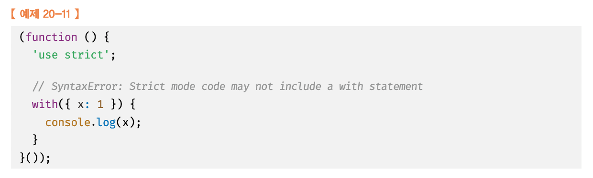
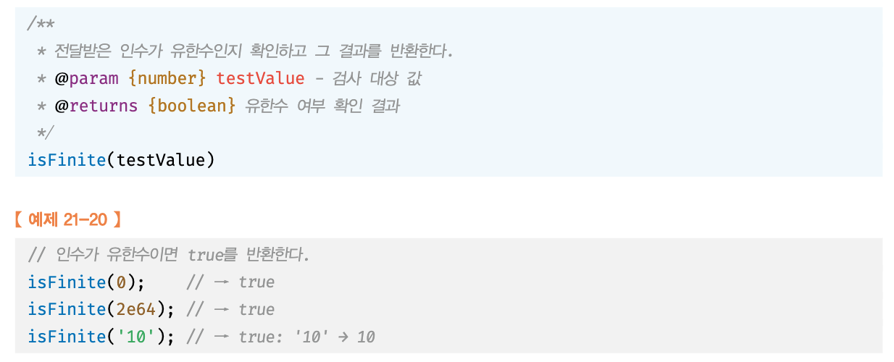

# 19장_프로토타입
프로토타입은 `유전자` 이다.

자바스크립트는 클래스 기반 객체지향 프로그래밍 언어보다 효율적이며 더 강력한 객체지향 프로그래밍 능력을 지니고 있는 프로토타입 기반의 객체지향 프로그래밍 언어이다.

자바스크립트는 객체 기반의 프로그래밍 언어이며 자바스크립트를 이루고 있는 거의 모든것이 객체다. 원시 타입의 값을 제외한 나머지 값들은 모두 객체다.

## 객체지향 프로그래밍
객체지향 프로그래밍은 프로그램을 명령어 또는 함수의 목록으로 보는 전톡적인 명령형 프로그래밍의 절차지향적 관점에서 벗어나 객체의 집합으로 프로그램을 표현하려는 프로그래밍 패러다임을 말한다.

객체지향 프로그래밍은 실세계의 실체를 인식하는 철학적 사고를 프로그래밍에 접목하려는 시도에서 시작한다.

### 추상화
사람에게는 다양한 속성이 있으나 우리기 구현하려는 프로그램에서는 사람의 이름과 주소라는 속성에만 관심있다고 가정해보자. 이처럼 다양한 속성 중에서 프로그램에 필요한 속성만 간추려 내어 표현하는 것을 추상화 라고 한다. 

```js
const person = {
  name: 'Lee',
  address: 'Seoul'
};

console.log(person); 
```
이름과 주소 속성으로 표현된 객체인 person 을 다른 객체와 구뱔하여 인식할 수 있다. 
이처럼 속성을 통해 여러개의 값을 하나의 단위로 구성한 복합적인 자료구조를 객체라고 하며, 객체지향 프로그래밍은 독립적인 객체의 집합으로 프로그램을 표현하려는 프로그래밍 패러다임이다.

원이라는 개념을 객체로 표현해볼때
- 반지름은 원의 속성이다.
- 반지름을 가지고 원의 지름, 둘레, 넓이를 구할 수 있다.
- 반지름은 원의 상태를 나타내고
- 원의 지름, 둘레, 넓이를 구하는 것은 동작이다.

이처럼 객체지향 프로그래밍은 객체의 상태를 나타내는 데이터와 상태 데이터를 조작할 수 있는 동작을 하나의 논리적인 단위로 묶어 생각한다 .
이때 객체의 상태를 프로퍼티, 동작을 메서드 라고 부른다.
- 객체의 상태 : 프로퍼티
- 객체의 동작 : 메서드

## 상속과 프로토타입
상속은 객체지향 프로그램의 핵심 개념이다. 
어떤 객체의 프로퍼티 또는 메서드를 다른 객체가 상속받아 그대로 사용할 수 있는 것을 말한다.

자바스크립트는 프로토타입을 기반으로 상속을 구현하여 불필요한 중복을 제거한다.
```js
//생성자함수
function Circle(radius){
  this.radius = radius;
  this.getArea = function () {
    return Math.PI * this.radius **2;
  }
}

//반지름이 1인 인스턴스 생성
const circle1 = new Circle(1);
//반지름이 2인 인스턴스 생성
const circle2 = new Circle(2);

//Circle 생성자 함수는 인스턴스를 생성할 때마다 동일한 동작을 하는 getArea 메서드를 중복 생성하고 모든 인스턴스가 중복소유한다. 
//getArea 메서드는 하나만 생성하여 모든 인스턴스가 공유해서 사용하는 것이 바람직하다.
console.log(circle1.getArea === circle2.getArea); // false

console.log(circle1.getArea()); // 3.14 ...
console.log(circle1.getArea()); // 12.566 ...
```

위 생성자 함수에는 문제가 있다.
Circle 생성자 함수가 생성하는 모든 객체는 radius 프로퍼티와 getArea 메서드를 갖는다. Circle 생성자 함수는 인스턴스를 생성할때마다 getArea 메서드를 중복 생성하고 모든 인스턴스가 중복 소유한다.


이처럼 동일한 생성자 함수에 의해 성성된 모든 인ㅅ턴스가 동일한 메서드를 중복 소유하는 것은 메모리를 불필요하게 낭비하는 것이다.

#### 상속을 통한 불필요한 중복 제거
자바스크립트는 프로토타입을 기반으로 상속을 구현한다.

```js
function Circle(radius){
  this.radius = radius;
}

// Circle 생성자 함수가 생성한 모든 인스턴스가 getArea 메서드를 공유해서 사용할 수 있도록 프로토타입에 추가한다.
// 프로토타입은 Circle 생성자 함수의 prototype 프로퍼티에 바인딩되어 있다.
Circle.prototype.getArea = function () {
  return Math.PI * this.radius **2;
};

//인스턴스 생성
const circle1 = new Circle(1);
const circle2 = new Circle(2);

//Circle 생성자 함수가 생성한 모든 인스턴스는 부모 객체의 역할을 하는 프로토타입 Circle.prototype으로부터 getArea 메서드를 상속받는다.
//즉, Circle 생성자 함수가 생성하는 모든 인스턴스는 하나의 getArea 메서드를 공유한다.
console.log(circle1.getArea() === circle2.getArea); // true

console.log(circle1.getArea()); // 3.14 ...
console.log(circle1.getArea()); // 12.566 ...
```


Circle 생성자 함수가 생성한 모든 인스턴스는 상위 객체 역할을 하는 Circle.prototype 의 모든 프로퍼티와 메서드를 상속받는다.

상속은 코드의 재사용이란 관점에서 매우 유용하다.

## 프로토타입 객체
프로토타입 객체란 객체지향 프로그래밍의 근간을 이루는 객체간 상속을 구현하기 위해 사용된다.

모든 객체는 [[Prototype]] 이라는 내부 슬롯을 가진다. 
[[Prototype]] 에 저장되는 프로토타입은 객체 생성 방식에 의해 결정되고, 저장된다.

[[Prototype]] 내부 슬롯에는 직접 접근할 수 없지만, __proto__ 접근자 프로퍼티를 통해 [[Prototype]] 내부슬롯이 가리키는 프로토타입에 간접적으로 접근할 수 있다. 

프로토타입은 자신의 constructor 프로퍼티를 통해 생성자 함수에 접근할 수 있고, 생성자 함수는 자신의 prototype 프로퍼티를 통해 프로토타입에 접근할 수 있다.


### __proto__ 접근자 프로퍼티

모든 객체는 __proto__ 접근자 프로퍼티를 통해 [[Prototype]] 내부슬롯이 가리키는 프로토타입에 간접적으로 접근할 수 있다.

#### __proto__ 은 접근자 프로퍼티다.
내부 슬롯은 프로퍼티가아니다. 따라서 자바스크립트는 원칙적으로 내부슬롯과 내부 메서드에 직접적으로 접근하거나 호출할 수 있는 방법을 제공하지는 않는다. 

그렇지만 __proto__ 접근자 프로퍼티를 통해 간접적으로 프로토타입에 접근할 수 있다.

[[Prototype]]의 값은 Prototype(프로토타입) 객체이며 __proto__ accessor property로 접근할 수 있다. __proto__ 프로퍼티에 접근하면 내부적으로 Object.getPrototypeOf가 호출되어 프로토타입 객체를 반환한다.

```js
var student = {
  name: 'Lee',
  score: 90
}
console.log(student.__proto__ === Object.prototype); // true
```
student 객체는 __proto__ 프로퍼티로 자신의 부모 객체(프로토타입 객체)인 Object.prototype을 가리키고 있다.

#### Object.prototype
모든 객체는 프로토타입 계층 구조인 프로토타입 체인에 묶여있다. 자바스크립트 엔진은 객체의 프로퍼티에 접근하려고 할 때 해당 객체에 접근하려는 프로퍼티가 없다면 __proto__접근자 프로퍼티가 가리키는 참조를 따라 자신의 부모 역할을 하는 프로토타입의 프로퍼티를 순차적으로 검색한다. 

프로토타입 체인의 최상위 객체는 Object.prototype 이며, 이 객체의 프로퍼티와 메서드는 모든 객체에 상속된다.

객체를 생성할 때 프로토타입은 결정된다. 결정된 프로토타입 객체는 다른 임의의 객체로 변경할 수 있다. 이것은 부모 객체인 프로토타입을 동적으로 변경할 수 있다는 것을 의미한다. 이러한 특징을 활용하여 객체의 상속을 구현할 수 있다.

#### 왜 [[Prototype]] 내부슬롯에 접근하기 위해 __proto__ 접근자 프로퍼티를 사용해야 하는걸까 ? 

그 이유는 상호 참조에 의해 프로토타입 체인이 생성되는 것을 방지하기 위해서다.

```js
const parent = {};
const child = {};

// child 의 프로토타입을 parent 로 설정
child.__proto__ = parent;
//parent 의 프로토타입을 child 로 설정
parent.__proto__=child;
```
1. parent 객체를 child 객체의 프로토타입으로 설정
2. child 객체를 parent 객체의 프로토타입으로 설정
=> 이렇게 되면 서로가 자신의 프로토타입이 되는 비정상 적은 프로토타입 체인이 만들어지기 때문에 __proto__ 접근자 프로퍼티는 에러를 발생시킨다.


이렇게되면 순환 참조를 하는 프로토타입이 만들어지고 이는 체인 종점이 존재하지 않기 때문에 프로토타입 체인에서 프로퍼티를 검색할 때 무한 루프에 빠진다. 따라서 아무런 체크 없이 무조건적으로 프로토타입을 교체할 수 없도록 __proto__ 접근자 프로퍼티를 통해 프로토타입에 접근하고 교체하도록 구현되어 있다.

### 함수 객체의 prototype 프로퍼티
모든 객체는 자신의 프로토타입 객체를 가리키는 [[Prototype]] 인터널 슬롯(internal slot) 을 갖으며 상속을 위해 사용된다.
함수도 객체이므로 [[Prototype]] 인터널 슬롯을 갖는다. 그런데 함수 객체는 일반 객체와는 달리 prototype 프로퍼티도 소유하게 된다.

```js
function Person(name) {
  this.name = name;
}

var foo = new Person('Lee');

console.dir(Person); // prototype 프로퍼티가 있다.
console.dir(foo);    // prototype 프로퍼티가 없다.
```
- [[Prototype]]
  - 함수를 포함한 모든 객체가 가지고 있는 인터널 슬롯이다.
  - 객체의 입장에서 자신의 부모 역할을 하는 프로토타입 객체를 가리키며 함수 객체의 경우 Function.prototype를 가리킨다. 

```js
console.log(Person.__proto__ === Function.prototype);
```

- prototype 프로퍼티
  - 함수 객체만 가지고 있는 프로퍼티이다.
  - 함수 객체가 생성자로 사용될 때 이 함수를 통해 생성될 객체의 부모 역할을 하는 객체(프로토타입 객체)를 가리킨다.

```js
console.log(Person.prototype === foo.__proto__);
```

### constructor 프로퍼티
모든 프로토타입 객체는 constructor 프로퍼티를 갖는다. 이 constructor 프로퍼티는 객체의 입장에서 자신을 생성한 객체를 가리킨다.

예를 들어 Person() 생성자 함수에 의해 생성된 객체를 foo라 하자. 이 foo 객체를 생성한 객체는 Person() 생성자 함수이다. 이때 foo 객체 입장에서 자신을 생성한 객체는 Person() 생성자 함수이며, foo 객체의 프로토타입 객체는 Person.prototype이다. 따라서 프로토타입 객체 Person.prototype의 constructor 프로퍼티는 Person() 생성자 함수를 가리킨다.

```js
function Person(name) {
  this.name = name;
}

var foo = new Person('Lee');

// Person() 생성자 함수에 의해 생성된 객체를 생성한 객체는 Person() 생성자 함수이다.
console.log(Person.prototype.constructor === Person);

// foo 객체를 생성한 객체는 Person() 생성자 함수이다.
console.log(foo.constructor === Person);

// Person() 생성자 함수를 생성한 객체는 Function() 생성자 함수이다.
console.log(Person.constructor === Function);
```

## 리터럴 표기법에 의해 생성된 객체의 생성자 함수와 프로토타입
생성자 함수에 의해 생성된 인스터스는 프로토타입의 constructor 프로퍼티에 의해 생성자 함수와 연결된다. 이때 constructor 프로퍼티가 가리키는 생성자 함수는 인스턴스를 생성한 생성자 함수이다.
```js
// obj 객체를 생성한 생성자 함수는 Object 다.
const obj = new Object();
console.log(obj.constructor === Object);

// add 함수 객체를 생성한 생성자 함수는 Function이다.
const add = new Function('a','b','return a + b');
console.log(add.constructor === Function); //true

// 생성자 함수
function Person(name) {
  this.name = name;
}

// me 객체를 생성한 생성자 함수는 Person 이다.
const me = new Person ('Lee');
console.log(me.constructor === Person); // true
```

## 프로토타입의 생성 시점
객체는 리터럴 표기법 또는 생성자 함수에 의해 생성되므로 결국 모든 객체는 생성자 함수와 연결되어 있다.

프로토타입은 생성자 함수가 생성되는 시점에 더불어 생성된다.
프로토타입과 생성자 함수는 단독으로 존재할 수 없고 언제나 쌍으로 존재하기 때문이다.

생성자 함수는 사용자가 직접 정의한 사용자 정의 생성자 함수와 자바스크립트가 기본 제공하는 빌트인 생성자 함수로 구분할 수 있다.

### 사용자 정의 생성자 함수와 프로토타입 생성 시점
생성자 함수로서 호출할 수 있는 함수, 즉 constructor 는 함수 정의가 평가되어 함수 객체를 생성하는 시점에 프로토타입도 더불어 생성된다. 

```js
//함수 정의(constructor 가 평가되어 함수 객체를 생성하는 시점에 프로토타입도 더불어 생성된다.)
console.log(Person.prototype);

//생성자 함수
function Person(name) {
  this.name = name;
}
```

생성자 함수로서 호출할 수 없는 함수, 즉 non-constructor 는 프로토타입이 생성되지 않는다.

```js
// 화살표 함수는 Non-constructor 이다.
const Person = name => {
  this.name = name;
};

// non-constructor 는 프로토타입이 생성되지 않는다.
console.log(Person.prototype); // undefined
```

함수 선언문은 런타임 이전에 자바스크립트엔진에 의해 먼저 실행된다. 따라서 함수 선언문으로 정의된 Person 생성자 함수는 런타임 이전에 평가되어 함수 객체가 된다.

이때 프로토타입도 더불어 생성된다. 생성된 프로토타입은 Person 생성자 함수의 prototype 프로퍼티에 바인딩된다. 아래는 Person 생성자 함수와 더불어 생성된 프로토타입의 내부이다.


생성된 프로토타입은 오직 constructor 프로퍼티만 갖는 객체이다. 프로토타입도 객체이고 모든 객체는 프로토타입을 가지므로 프로토타입도 자신의 프로토타입을 갖는다. 생성된 프로토타입의 프로토타입은 Object.prototype 이다.


이처럼 사용자 정의 생성자 함수는 자신이 평가되어 함수 객체로 생성되는 시점에 프로토타입도 더불어 생성되며, 생성된 프로토타입의 프로토타입은 언제나 Object.prototype 이다.

### 빌트인 생성자 함수와 프로토타입 생성 시점

#### 빌트인 생성자 함수
- Object
- String
- Number
- Function
- Array
- RefExp
- Date
- Promise

위와 같은 빌트인 생성자 함수도 생성되는 시점에 프로토타입이 생성된다. 모든 빌트인 생성자 함수는 전역 객체가 생성되는 시점에 생성된다. 생성된 프로토타입은 빌트인 생성자 함수의 prototype 프로퍼티에 바인딩된다.

이처럼 객체가 생성되기 이전에 생성자 함수와 프로토타입은 이미 객체화되어 존재한다. 이후 생성자 함수 또는 리터럴 표기법으로 객체를 생성하면 프로토타입은 생성된 객체의 [[Prototype]] 내부슬롯에 할당된다. 이로써 생성된 객체는 프로토타입을 상속받는다.

## 19.6 객체 생성방식과 프로토타입의 결정

#### 객체의 생성방법
- 객체 리터럴
- Object 생성자 함수
- 생성자 함수
- Object.create 메서드

위 객체 생성 방법은 모두 추상 연산 OrdinaryObjectCreate 에 의해 객체가 생성된다는 공통점이 있다.

- 추상연산 OrdinaryObjectCreate 의 동작
    1. 추상 연산 OrdinaryObjectCreate 은 자신이 생성할 객체의 프로토타입을 인수로 전달받는다. 자신이 생성할 객체에 추가할 프로퍼티 목록을 옵션으로 전달할 수도 있다.
    2. 추상 연산 OrdinaryObjectCreate 은 빈객체를 생성하고, 객체에 추가할 프로퍼티목록이 인수로 전달될 경우 프로퍼티를 객체에 추가한다.
    3. 인수로 전달받은 프로토타입을 자신이 생성한 객체의 [[Prototype]] 내부슬롯에 할당한다
    4. 생성한 객체를 반환한다.

즉 프로토타입은 추상연산 OrdinaryObjectCreate에 전달되는 인수에 의해 결정되며, 인수는 객체가 생성되는 시점에 객체 생성 방식에 의해 결정된다.

#### 19.6.1 객체 리터럴에 의해 생성된 객체의 프로토타입

- 추상 연산 OrdinaryObjectCreate 에 전달되는 프로토타입 : Object.prototype
  - 객체 리터럴에 의해 생성되는 객체의 프로토타입 = Object.prototype

```js
const obj = { x: 1 };
```
위 객체 리터럴이 평가되면 추상 연산 OrdinaryObjectCreate에 의해 Object 생성자 함수와 Object.prototype 과 생성된 객체 사이에 연결이 만들어진다.


객체 리터럴에 생성된 obj 객체는 Object.prototype 을 프로토타입으로 갖고, 상속받는다. obj 객체는 constructor 프로퍼티와 hasOwnProperty 메서드를 소유하지 않지만 자신의 프로토타입인 Object.prototype 으로부터 상속받아 자유롭게 사용할 수 있다.


#### 19.6.2 Object 생성자 함수에 의해 생성된 객체의 프로토타입

Object 생성자 함수를 인수 없이 호출하면 빈객체가 생성된다. 이때 추산연산 OrdinaryObjectCreate 가 호출되고 여기에 전달되는 프로토타입은 Object.prototype 이다. 즉, Object 생성자 함수에 의해 생성되는 객체의 프로토타입은 Object.prototype 이다.

```js
const obj = new Object();
obj.x = 1;
```


Object 생성자 함수에 의해 생성된 obj 객체는 Object.prototype 을 프로토타입을 갖고, 상속받는다. 객체 리터럴에 의해 생성된 객체와 동일한 구조를 갖는 것을 알 수 있다.

```js
const obj = new Object();
obj.x = 1;

// Object 생성자 함수에 의해 생성된 obj 객체는 Object.prototype 을 상속받는다.

console.log(obj.constructor === Object); //true
console.log(obj.hasOwnProperty('x')); //true
```

객체 리터럴 방식은 객체 리터럴 내부에 프로퍼티를 추가하지만 Object 생성자 함수 방식은 일단 빈 객체를 생성한 이후 프로퍼티를 추가한다는 차이점이 있다.

#### 19.6.3 생성자 함수에 의해 생성된 객체의 프로토타입
new 연산자와 함께 생성자 함수를 호출해 인스턴스를 생성하면 추상 연산 OrdinaryObjectCreate 가 호출된다. 이때 추상 연산 OrdinaryObjectCreate 에 전달되는 프로토타입은 생성자 함수의 prototype 프로퍼티에 바인딩 되어있는 객체다. 

```js
function person(name) {
  this.name = name;
}

const me = new Person('Lee');
```


사용자 정의 함수 Person 과 더불어 생성된 프로토타입 Person.prototype 의 프로퍼티는 constructor 뿐이다.

프로토타입 Person.prototype 에 프로퍼티 추가
```js
function Person(name) {
  this.name = name;
}

// 프로토타입 메서드
Person.prototype.sayHello = function () {
  console.log(`Hi! My name is ${this.name}`);
};

const me = new Person('Lee');
const you = new Person('Kim');

me.sayHello(); //Hi! My name is Lee
you.sayHello();//Hi! My name is Kim
```

Person 생성자 함수를 통해 생성된 모든 객체는 프로토타입에 추가된 sayHello 메서드를 상속받아 자신의 메서드처럼 사용할 수 있다.


## 19.7 프로토타입 체인

```js
function Person(name) {
  this.name = name;
}

// 프로토타입 메서드
Person.prototype.sayHello = function () {
  console.log(`Hi! My name is ${this.name}`);
};

const me = new Person('Lee');

//hasOwnProperty는 Object.prototype의 메서드다
console.log(me.hasOwnProperty('name')); //true
```

Person 생성자 함수에 의해 생성된 me 객체는 hasOwnProperty 를 호출할 수 있다.
- me 객체는 다음을 상속받았다.
  - Person.prototype
  - Object.prototype

me 객체의 프로토타입은 Person.prototype 이고, Person.prototype 의 프로토타입은 Object.prototype 이다. (프로토타입의 프로토타입은 언제나 Object.prototype 이다.)

```js
Object.getPrototypeOf(Person.prototype) === Object.prototype; // true
```

**자바스크립트는 객체의 프로퍼티에 접근하려고 할 때 해당 객체에 접근하려는 프로퍼티가 없다면 [[Prototype]] 내부 슬롯의 참조를 따라 자신의 부모 역할을 하는 프로토타입의 프로퍼티를 순차적으로 검색한다. 이를 프로토타입 체인이라고 한다. 프로토타입 체인은 자바스크립트가 객체지향 프로그래밍의 상속을 구현하는 매커니즘이다.**

```js
//hasOwnProperty 는 Object.prototype 의 메서드다.
//me 객체는 프로토타입 체인을 따라 hasOwnProperty 메서드를 검색하여 사용한다.

me.hasOwnProperty('name'); //true
```
- 자바스크립트엔진의 메서드 검색 순서
  1. me 객체에서 hasOwnProperty 메서드를 검색한다. 
    - me 객체에는 hasOwnProperty 가 없음 -> Person.prototype 으로 이동해 hasOwnProperty를 검색한다. 
  2. Person.prototype 에도 hasOwnProperty 없으므로 Object.prototype 으로 이동해 hasOwnProperty를 검색한다.
  3. Object.prototype에는 hasOwnProperty가 존재한다.
    - 자바스크립트엔진은 Object.prototype.hasOwnProperty 메서드를 호출한다. 
    - 이때 Object.prototype.hasOwnProperty 메서드의 this 에는 me 객체가 바인딩된다.
```js
Object.prototype.hasOwnProperty.call(me, 'name');

// *call 메서드
// call 메서드는 this 로 사용할 객체를 전달하면서 함수를 호출한다.
// this 로 사용할 me 객체를 전달하면서 Object.prototype.hasOwnProperty 메서드를 호출
```

프로토타입 체인의 최상위에 위치하는 객체는 언제나 Object.prototype 이다. 따라서 모든 객체는 Object.prototype 을 상속받는다. Object.prototype을 프로토타입의 체인의 종점이라고 한다. Object.prototype의 프로토타입 ([[Prototype]] 내부 슬롯) 의 값은 null 이다.

- 스코프 체인 : 식별자 검색을 위한 매커니즘
- 프로토타입 체인 : 상속과 프로퍼티 검색을 위한 매커니즘

## 19.8 오버라이딩과 프로퍼티 섀도잉
```js
const Person = (function(){
  //생성자 함수
  function Person(name){
    this.name = name;
  }

  //프로토타입 메서드
  Person.prototype.sayHello = function () {
    console.log(`Hi! My name is ${this.name}`);
  };

  //생성자 함수를 반환return Person
}());

const me = new Person('Lee');

me.sayHello = function () {
  console.log(`Hey! My name is ${this.name}`);
};

me.sayHello(); // Hey! My name is Lee
```
- 프로토타입 프로퍼티 : 프로토타입이 소유한 프로퍼티(메서드 포함)
- 인스턴스 프로퍼티 : 인스턴스가 소유한 프로퍼티

인스턴스 메서드 sayHello 는 프로토타입 메서드 sayHello 를 오버라이딩 했다, 이처럼 상속 관계에 의해 프로퍼티가 가려지는 현상을 프로퍼티 섀도잉 이라고 한다.

- 오버라이딩
  - 상위 클래스가 가지고 있는 메서드를 하위 클래스가 재정의하여 사용하는 방식

하위 객체를 통해 프로토타입의 프로퍼티를 변경, 또는 삭제하는 것은 불가능하다. (하위 객체를 통해 프로토타입에 set 액세스는 허용되지 않는다)
```js
delete me.sayHello; // 삭제시도
me.sayHello(); // 삭제안됨

Person.prototype.sayHello = function () {
  console.log(`Hey! My name is ${this.name}`);
};

me.sayHello(); // Hey ! My name is Lee

```

프로토타입 프로퍼티를 변경, 또는 삭제하려면 프로토타입에 직접 접근해야한다.
```js
delete Person.prototype.sayHello;
me.sayHello(); //TypeError: me.sayHello is not a function
```

## 19.9 프로토타입의 교체

프로토타입은 임의의 다른 객체로 변경할 수 있다. 
프로토타입은 생성자함수 또는 인스턴스에 의해 교체할 수 있다.

### 19.9.1 생성자 함수에 의한 프로토타입의 교체


1 에서 Person.prototype 에 객체 리터럴을 할당했다.
이는 Person 생성자 함수가 생성할 객체의 프로토타입을 객체 리터럴로 교체한 것이다.


프로토타입으로 교체한 객체 리터럴에는 constructor 프로퍼티가 없다.
constructor 프로퍼티는 자바스크립트 엔진이 프로토타입을 생성할 때 암묵적으로 추가한 프로퍼티이다. 따라서 me 객체의 생성자 함수를 검색하면 Person 이 아닌 Object 가 나온다.

### 19.9.2 인스턴스에 의한 프로토타입의 교체

프로토타입은 생성자 함수의 prototype 프로퍼티 뿐 아니라 인스턴스의 __proto__ 접근자 프로퍼티를 통해 접근할 수 있다. __proto__ 접근자 프로퍼티를 통해 프로토타입을 교체하는 것은 이미 생성된 객체의 프로토타입을 교체하는 것이다.


생성자 함수에 의한 프로토타입의 교체와 마찬가지로 프로토타입으로 교체한 객체는 constructor 프로퍼티가 없으므로 constructor 프로퍼티와 생성자 함수간의 연결이 파괴된다. 따라서 프로토타입의 constructor 프로퍼티로 me 객체의 생성자 함수를 검색하면 Person 이 아닌 Object 가 나온다.

```js
//프로토타입을 교체하면 constructor 프로퍼티와 생성자 함수 간의 연결이 파괴된다.
console.log(me.constructor === Person); //false

//프로토타입 체인을 따라 Object.prototype 의 constructor 프로퍼티가 검색된다.
console.log(me.constructor === Object); //true
```


프로토타입 교체를 통해 객체 간의 상속관계를 동적으로 변경하는 것은 번거롭기 때문에 프로토타입은 직접 교체하지 않는 것이 좋다.

## 19.10 instanceof 연산자

instanceof 연산자는 이항 연산자로서 좌변에 객체를 가리키는 식별자, 우변에 생성자 함수를 가리키는 식별자를 피연산자로 받는다, 

```js
객체 instanceof 생성자 함수
```
우변의 생성자 함수의 prototype 에 바인딩된 객체가 좌변의 객체의 프로토타입 체인 상에 존재하면 true, 그렇지 않으면 false 로 평가된다

```js
function Person(name) {
  this.name = name;
}

const me = new Person('Lee');

//Person.prototype 이 me 의 객체 프로토타입 체인 상에 존재하므로 true 로 평가된다.
console.log(me instanceof Person); //true

//Object.prototype 이 me 의 객체 프로토타입 체인 상에 존재하므로 true 로 평가된다.
console.log(me instanceof Object); //true
```

## 19.11 직접 상속

### 19.11.1 Object.create 에 의한 직접 상속
Object.create 메서드는 명시적으로 프로토타입을 지정해 새로운 객체를 생성한다. Object.create 메서드도 추상연산 OrdinaryObjectCreate 를 호출한다. 

- Object.create 메서드의 매개변수
  - 1. 첫번째 매개변수 : 생성할 객체의 프로토타입으로 지정할 객체를 전달
  - 2. 두번째 매개변수 : 생성할 객체의 프로퍼티 키와 프로피티 디스크립터 객체로 이뤄진 객체를 전달.(옵션으로 생략이 가능하다)


Object.create 메서드는 첫번째 매개변수에 전달한 객체의 프로토타입 체인에 속하는 객체를 생성한다. 즉 객체를 생성하면서 직접적으로 상속을 구현하는 것이다. 이 메서드의 장점은 다음과 같다.
- new 연산자가 없어도 객체를 생성할 수 있다.
- 프로토타입을 지정하면서 객체를 생성할 수 있다.
- 객체 리터럴에 의해 생성된 객체도 상속받을 수 있다.

### 19.11.2 객체 리터럴 내부에서 __proto__ 에 의한 직접 상속
Object.create 메서드로 직접 상속을 구현할 수 있지만 두 번째 인자로 프로퍼티를 정의하는 것은 번거롭다. ES6 에서는 객체 리터럴 내부에서 __proto__ 접근자 프로퍼티를 사용해 직접 상속을 구현할 수 있다.

```js
const myProto = { x: 10 };

const obj = {
  y:20,
  // 객체를 직접 상속받는다
  // obj -> myProto => Object.prototype -> null
  __proto__: myProto
};

console.log(obj.x, obj.y); //10 20
console.log(Object.getPrototypeOf(obj) === myProto);//true
```

## 19.12 정적 프로퍼티/메서드
정적 프로퍼티/메서드는 생성자 함수로 인스턴스를 생성하지 않아도 참조/호출 할 수 있는 프로퍼티/메서드를 말한다.


Person 생성자 함수는 객체이므로 자신의 프로퍼티/메서드를 소유할 수 있다. Person 생성자 함수 객체가 소유한 프로퍼티/메서드를 정적 프로퍼티/메서드 라고한다. 정적 프로퍼티/메서드는 생성자 함수가 생성한 인스턴스로 참조/호출할 수 없다.

생성자 함수가 생성한 인스턴스는 자신의 프로토타입 체인에 속한 객체의 프로토타입/메서드에 접근할 수 있지만 정적 프로퍼티/메서드는 인스턴스의 프로토타입 체인에 속한 객체의 프로퍼티/메서드가 아니므로 인스턴스로 접근할 수 없다.

Object.create : Object 생성자 함수의 정적 메서드
Object.prototype.hasOwnProperty : Object.prototype 의 메서드

따라서 Object.create 메서드는 Object 생성자 함수가 생성한 객체로 호출할 수 없다. 하지만 Object.prototype.hasOwnProperty 메서드는 모든 객체의 프로토타입 체인의 종점, 즉 Object.prototype 의 메서드링므로 모든 객체가 호출할 수 있다.

```js
//Object.create 는 정적 메서드다.
const obj = Object.create({name: 'Lee'});

//Object.prototype.hasOwnProperty는 프로토타입 메서드다.
obj.hasOwnProperty('name'); //false
```

만약 인스턴스/프로토타입 메서드 내에서 this 를 사용하지 않는다면 그 메서드는 정적 메서드로 변경할 수 있다. 인스턴스가 호출한 인스턴스/프로토타입 메서드 내에서 this 는 인스턴스를 가리킨다. 프로토타입 메서드를 호출하려면 인스턴스를 생성해야 하지만 정적 메서드는 인스턴스를 생성하지 않아도 호출할 수 있다.


## 19.13 프로퍼티 존재 확인
### 19.13.1 in 연산자

in 연산자는 객체 내에 특정 프로퍼티가 존재하는지 여부를 확인한다.
```js
const person = {
  name: 'Lee',
  address: 'Seoul'
};

console.log('name' in person); //true
console.log('address' in person); //true
console.log('age' in person); //false
```

in 연산자는 객체가 상속받은 모든 프로토타입의 프로퍼티를 확인한다
```js
console.log('toString' in person)// true
//toString 은 Object.prototype 의 메서드다.
```

### 19.13.2 Object.prototype.hasOwnProperty 메서드
```js
console.log(person.hasOwnProperty('name')); //true
console.log(person.hasOwnProperty('age')); //false
console.log(person.hasOwnProperty('toString')); //false
```

## 19.14 프로퍼티 열거 

### 19.14.1 for...in 문

객체의 모든 프로퍼티를 순회하며 열거하기 위해 for...in 문을 사용한다.

```js
const person = {
  name: 'Lee',
  address: 'Seoul'
}

for (const key in person){
  console.log(key + ': ' + person[key]);
}
```
for...in 문은 객체의 프로퍼티 개수만큼 순회하며 for...in 문의 변수 선언문에서 선언한 변수에 프로퍼티 키를 할당한다. 

for...in 문은 in 연산자처럼 상속받은 프로토타입의 프로퍼티까지 열거한다. 


위 예제에서는 Object.prototype 의 toString 이 열거되지 않앗는데, 이는 toString 메서드가 열거할 수 없도록 정의되어있는 프로퍼티이기때문이다. for...in 문은 객체의 프로토타입 체인 상에 존재하는 모든 프로토타입의 프로퍼티중에서 프로퍼티 어트리뷰트 [[Enumerable]]의 값이 true 인 프로퍼티를 순회하며 열거한다.

### 19.14.2 Object.keys/values/entries 메서드

for...in 문은 객체 자신의 고유 프로퍼티 뿐 아니라 상속받은 프로퍼티도 열거한다. 따라서 객체 자신의 프로퍼티인지 확인하는 추가 처리가 필요하다.

객체 자신의 고유 프로퍼티만 열거하지 위해서는 Object.keys/values/entries 메서드 를 사용하는 것을 권장한다. 

#### Object.keys
Object.keys 메서드는 객체 자신의 열거가능한 프로퍼티키를 배열로 반환한다.


#### Object.values
Object.values 메서드는 객체 자신의 열거가능한 프로퍼티 값을 배열로 반환한다.

```js
console.log(Object.values(person)); //["Lee","Seoul"]
```

#### Object.entries
Object.entries 메서드는 객체 자신의 열거가능한 프로퍼티 키와 값의 쌍의 배열을 배열에 담아 반환한다. 
```js
for (let pair of formData.entries()) {
  console.log(pair[0] + ": " + pair[1]);
}
```

# 20장_strict mode

```js
function foo() {
  x = 10;
}

foo();

console.log(x);
```

foo 함수 내에서 선언하지 않은 x 변수에 값을 할당했다. 이때 x 변수를 찾아야 x 에 값을 할당할 수 있기 때문에 자바스크립트 엔진은 x 변수가 어디에서 선언되었는지 스코프 체인을 통해 검색하기 시작한다.

자바스크립트 엔진은
1. foo 함수의 스코프에서 x변수의 선언을 검색한다. 
   - foo 함수의 스코프에는 x 변수의 선언이 없으므로 검색에 실패한다.
2. foo 함수 컨텍스트의 상위 스코프에서 x 변수의 선언을 검색한다.
   - 상위스코프(전역스코프) 에도 x 변수의 선언이 존재하지 않는다. 
3. 암묵적으로 전역객체에 x 프로퍼티를 동적 생성한다. 
   - 이 때 전역객체의 x 프로퍼티는 마치 전역 변수처럼 사용할 수 있다. 이러한 현상은 암묵적 전역이라 한다.

위와 같이 개발자의 의도와 상관없이 발생한 암묵적 전역은 오류를 발생시키는 원인이 될 가능성이 크다. 
이런 오타나 문법 ㅈ식의 미비로 인한 실수는 발생한다. 이를 지원하기 위해 ES5 부터 strict mode(엄격모드) 가 추가되었다. 

## 20.2 strict mode 의 적용
strict mode 를 적용하려면 전역의 선두 또는 함수 몸체의 선두에 'use strict'; 를 추가한다.
```js 
'use strict';

function foo() {
  x = 10; //ReferenceError: x is not defined
}

foo();
```

## 20.3 전역에 Strict mode 를 적용하는 것은 피하자
스크립트 단위로 적용된 strict mode 는 다른 스크립ㅌ에 영향을 주지 않고 해당 스크립트에 한정되어 적용된다.
하지만 strict mode 스크립트와 non-strict mode 스크립트를 혼용하는 것은 오류를 발생시킬 수 있다. 특히 라이브러리가 Non-strict mode 인 경우도 있기 때문에 바람직하지 않다. 

즉시 실행 함수로 스크립트 전체를 감싸서 스코프를 구분하고 즉시 실행함수의 선두에 Strict mode 를 적용한다.
```js
(function(){
  'use strict';

  //Do something...
}())
```

## 20.4 함수 단위로 strict mode 를 적용하는 것도 피하자
어떤 함수는 strict mode 를 적용하고 어떤함수는 적용하지 않는 것은 바람직하지 않다. 따라서 Strict mode 는 즉시실행함수로 감싼 스크립트 단위로 적용하는 것이 바람직하다.

## 20.5 strict mode 가 발생시키는 에러
### 20.5.1 암묵적 전역
선언하지 않은 변수를 참조하면 ReferenceError 가 발생한다.


### 20.5.2 변수, 함수, 매개변수의 삭제
delete 연산자로 변수,함수,매개변수를 삭제하면 syntaxError 가 발생한다


### 20.5.3 매개변수 이름의 중복
중복된 매개변수 이름을 사용하면 syntaxError 가 발생한다.


### 20.5.4 with 문의 사용
with 문을 사용하면 SyntaxError 가 발생한다. with 문은 동일한 객체의 프로퍼티를 반복해서 사용할 때 객체이름을 생략할 수 있어서 코드가 간단해지는 효과가 있지만 성능과 가독성이 나빠지는 문제가 있어 with 문은 사용하지 않는 것이 좋다.


## 20.6 strict mode 적용에 의한 변화
### 20.6.1 일반함수의 this
strict mode 에서  함수를 일반 함수로서 호출하면 this 에 undefined 가 바인딩된다. 생성자 함수가 아닌 일반 함수 내부에서는 this 를 사용할 필요가 없기 때문이다.


### 20.6.2 arguments 객체
strict mode 에서는 매개변수에 전달된 인수를 재할당해 변경해도 arguments 객체에 반영되지 않는다.


# 21장_빌트인 객체
## 21.1 자바스크립트 객체의 분류

#### 1. 표준 빌트인 객체
ECMAScript 사양에 정의된 객체. 표준 빌트인 객체는 전역 객체의 프로퍼티로서 제공된다. 따라서 별도의 선언 없이 전역변수처럼 언제나 참조할 수 있다.

#### 2. 호스트 객체
호스트객체는 ECMAScript 사양에 정의되지 않았지만 자바스크립트 실행환경에서 추가로 제공하는 객체를 말한다. 
- 브라우저 환경
  - DOM, BOM, Canvas, XMLHttpRequest, fetch 등과 같은 클라이언트 사이드 Web Api 를 호스트 객체로 제공하고, Node js 환경에서는 Node.js 고유의 API 를 호스트 객체로 제공한다.

#### 3. 사용자 정의 객체
표준 빌트인 객체와 호스트 객체처럼 기본제공되는 객체가 아닌 사용자가 직접 정의한 객체를 말한다.

## 21.2 표준 빌트인 객체
자바스크립트는 Object, String, Number, Boolean, Symbol, Date, Math, RegExp, Array, Map/Set, Function, Promise, Reflect, Proxy, Json, Error등 40 여개의 표준 빌트인 객체를 제공한다.

표준 빌트인 객체인 String, Number, Boolean, Function, Array, Date 는 생성자 함수로 호출해 인스턴스를 생성할 수 있다.


생성자 함수인 표준 빌트인 객체가 생성한 인스턴스의 프로토타입은
표준 빌트인 객체인 Prototype 프로퍼티에 바인딩된 객체다. 예를 들어 표준 빌트인 객체인 String 을 생성자 함수로서 호출해 생성한 String 인스턴스의 프로토타입은 String.prototype 이다.


## 21.3 원시값과 래퍼객체
문자열이나 숫자, 불리언 등의 원시값이 있는데도 문자열, 숫자, 불리언 객체를 생성하는 표준 빌트인 생성자 함수가 존재하는 이유는 무엇일까 ?

아래 예제에서 원시값은 객체가 아니므로 프로퍼티나 메서드를 가질 수 없는데도 원시이인 문자열이 마치 객체처럼 동작한다.


이는 원시값에 객체처럼 접근하면 자바스크립트 엔진이 일시적으로 원시값을 연관된 객체로 변환해주기 때문이다. 원시값을 객체처럼 사용하면 자바스크립트 엔진은 암묵적으로 래퍼객체를 생성해 생성된 객체로 프로퍼티에 접근하거나 메서드를 호출하고 다시 원시값으로 되돌린다.


문자열에 대해 마침표로 접근했을 때 그 순간 래퍼객체인 String 생성자 함수의 인스턴스가 생서외고 문자열은 래퍼 객체의 [[StringData]] 내부 슬롯에 할당된다. 이때 문자열 래퍼 객체인 STRING 생성자 함수의 인스턴스는 String.prototype의 메서드를 상속받아 사용할 수 있다.

## 21.4 전역 객체

전역객체는 코드가 실행되기 이전 단계에 자바스크립트 엔진에 의해 어떤 객체보다도 먼저 생성되는 특수한 객체이며, 어떤 객체에도 속하지 않은 최상위 객체이다. 전역 객체는 자바스크립트 환경에 따라 지칭하는 이름이 제각각이다. 

**브라우저 환경에서는 window 가 전역객체를 가리키지만 Node.js 환경에서는 global 이 전역 객체를 가리킨다**

- 전역 객체의 특정
  - 전역 객체는 개발자가 의도적으로 생성할 수 없다. 즉, 저ㅓㄴ역 객체를 생성할 수 있는 생성자 함수가 제공되지 않는다.
  - 전역 객체의 프로퍼티를 참조할 때 window 를 생략할 수 있다.
  - 전역 객체는 Object, String, Number, Boolean, RegExp, Array, Function, Promise 같은 모든 표준 빌트인 객체를 프로퍼티로 가지고 있다.
  - 자바스크립트 실행환경에 따라 추가적으로 프로퍼티와 메서드를 갖는다.
  - var 키워드로 선언한 전역변수와 선언하지 않은 변수에 값을 할당한 암묵적 전역, 그리고 전역함수는 전역 객체의 프로퍼티가 된다. 

  - let 이나 const 키워드로 선언한 전역 변수는 전역 객체의 프로퍼티가 아니다. 즉, window.foo 와 같이 접근할 수 없다. 
  - 브라우저 환경의 모든 자바스크립트 코드는 하나의 전역객체 window 를 공유한다. 
  
전역객체는 몇가지 프로퍼티와 메서드를 가지고 있다. 전역 객체의 프로퍼티와 메서드는  global 이나 window 를 생략하여 참조/호출할 수 있으므로 전역 변수와 전역 함수처럼 사용할 수 있다.

### 21.4.1 빌트인 전역 프로퍼티
빌트인 전역 프로퍼티는 전역 객체의 프로퍼티를 의미한다. 

- Infinity : Infinity 프로퍼티는 무한대를 나타내는 숫자값 Infinity 를 갖는다
- NaN : NaN 프로퍼티는 숫자가 아님을 나타내는 숫자값 NaN을 갖는다.
- undefined : undefined 프로퍼티는 원시 타입 undefined 를 값으로 갖는다.

### 21.4.2 빌트인 전역 함수
빌트인 전역 함수는 애플리케이션 전역에서 호출할 수 있는 빌트인 함수로서 전역 객체의 메서드다.

#### eval 
eval 함수의 사용은 금지해야 한다.

#### isFinite
전달받은 인수가 정상적인 유한수인지 검사하여 유한수이면 true 를 반환하고, 무한수이면 false 를 반환한다. 이때 인수가 NaN 으로 평가되는 값이라면 false 를 반환한다.



#### isNaN
전달받은 인수가 NaN 인지 검사하여 그 결과를 불리언 타입으로 반환한다 . 전달받은 인수의 타입이 숫자가 아닌 경우 숫자로 타입을 변환한 후 검사를 수행한다.


#### parseFloat
전달받은 문자열 인수를 부동 소수점 숫자, 즉 실수로 해석해 반환한다.


#### parseInt
전달받은 문자열 인수를 정수로 해석 하여 반환한다.


#### encodeURI/decodeURI

- encodeURI
  - encodeURI 함수는 완전한 URI 를 문자열로 전달받아 이스케이프 처리를 위해 인코딩한다. URI 는 인터넷에 있는 자원을 나타내는 유일한 주소를 말한다. 


- 인코딩
  - 인코딩이란 URI 의 문자들을 이스케이프 처리하는 것을 의미한다. 이스케이프 처리는 네트워크를 통해 정보를 공유할 때 어떤 시스템에서도 읽을 수 있는 아스키 문자 셋으로 변환하는 것이다.
  - URI 문법 형식 표준에 따르면 URL 은 아스키 문자셋으로만 구성되어야 하며 한글을 포함한 대부분의 외국어나 아스키 문자 셋에 정의되지 않은 특수 문자의 경우 URL 에 포함될 수 없다. 따라서 URL 내에서 의미를 갖고 있는 문자나 URL 에 올 수 없는 문자 또는 시스템에 의해 해석될 수 있는 문자를 이스케이프 처리하여 야기될 수 있는 문제를 예방하기 위해 이스케이프 처리가 필요하다.

- decodeURI 
  - decodeURI 함수는 인코딩된 URI 를 인수로 전달받아 이스케이프 처리 이전으로 디코딩한다.


#### 21.4.3 암묵적 전역
```js
var x = 10;

function foo(){
  y = 20;
}

foo(); 

console.log(x+y); // 30
```

foo 함수 내의 y 는 선언하지 않은 식별자다. 따라서 y =20 이 실행되면 참조에러가 발생할 것처럼 보인다. 하지만 선언하지 않은 식별자 y는 마치 선언된 전역 변수처럼 동작한다. 이는 선언하지 않은 식별자에 값을 할당하면 전역 객체의 프로퍼티가 되기 때문이다. foo 함수가 호출되면 자바스크립트 엔진은 y 변수에 값을 할당하기 위해 먼저 스코프 체인을 통해 선언된 변수인지 확인한다, 이때 foo 함수의 스코프와 전역 스코프 어디에서도 y 변수의 선언을 찾을 수 없으므로 참조 에러가 발생한다. 하지만 자바스크립트 엔진은 y=20 을 window.y = 20 으로 해석하여 전역 객체에 프로퍼티를 동적 생성한다. 결국 y는 전역 객체의 프로퍼티가 되어 마치 전역 변수처럼 동작한다. 이러한 현상을 암묵적전역이라 한다.


