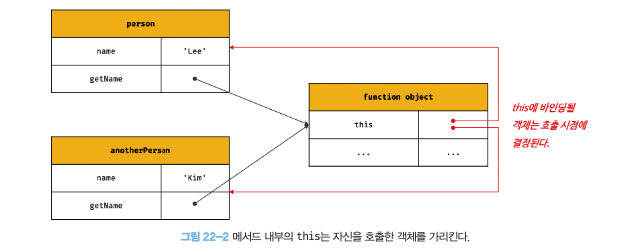
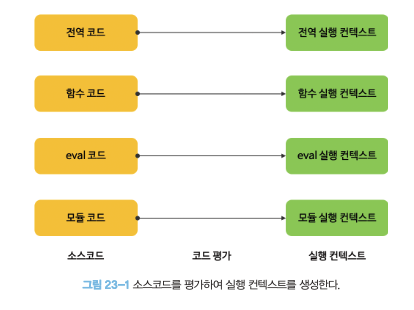
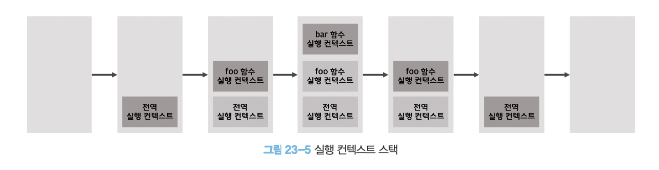

# 22장_this

## 22.1 this 키워드
동작을 나타내는 메서드가 자신이 속한 객체의 프로퍼티를 참조하려면 머저 자신이 속하 객체를 가리키는 식별자를 참조할 수 있어야 한다.

#### 객체 리터럴 방식으로 생성한 객체
- 메서드 내부에서 자신이 속한 객체를 가리키는 식별자를 재귀적으로 참조하는 경우
```js
const circle = {
  radius: 5,              // 프로퍼티 : 객체 고유의 상태 데이터
  getDiameter() {         // 메서드 : 상태 데이터를 참조하고 조작하는 동작
    // 이 메서드가 자신이 속한 객체의 프로퍼티나 다른 메서드를 참조하려면
    // 자신이 속한 객체인 circle 을 참조할 수 있어야 한다. 
    return 2 * circle.radius;
  }
};

console.log(circle.getDiameter()); // 10
```

getDiameter 메서드 내에서 식별자 circle 을 참조하고있다. 
이 참조 표현식이 평가되는 시점은 getDiameter 메서드가 호출되어 함수 몸체가 실행되는 시점이다.

- getDiameter 메서드가 호출되는 시점에는 객체 리터럴의 평가가 완료되어 객체가 생성되고, circle 식별자에 생성된 객체가 할당된 이후이다. 
- 따라서 메서드 내부에서 circle 식별자를 참조할 수 있다. 

#### 생성자 함수 방식으로 인스턴스를 생성하는 경우

```js
function Circle(radius) {
  //이 시점에는 생성자 함수 자신이 생성할 인스턴스를 가리키는 식별자를 알 수 없다. 
  ????.radius = radius;
}

Circle.prototype.getDiameter = function () {
  //이 시점에는 생성자 함수 자신이 생성할 인스턴스를 가리키는 식별자를 알 수 없다. 
  return 2 * ????.radius;
};

// 생성자 함수로 인스턴스를 생성하려면 먼저 생성자 함수를 정의해야 한다.
const circle = new Circle(5);
```

생성자 함수 내부에서 프로퍼티나 메서드를 추가하기 위해 자신이 생성할 인스턴스를 참조할 수 있어야 한다. 
하지만 생성자 함수로 인스턴스를 생성하려면 먼저 생성자 함수를 new 연산자와 함께 호출해야한다. 

생성자 함수를 정의하는 시점에는 아직 인스턴스를 생성하기 전이므로 이를 가리키는 특수한 식별자가 필요하다. 

**this 는 자신이 속한 객체 또는 자신이 생성할 인스턴스를 가리키는 자기 참조 변수이다. this 를 통해 자신이 속한 객체 또는 자신이 생성할 인스턴스의 프로퍼티나 메서드를 참조할 수 있다.** 

- this 는 자바스크립트 엔진에 의해 암묵적으로 생성된다. 
- this 는 코드 어디서든 참조할 수 있다.
- 함수를 호출하면 arguments 객체와 this 가 암묵적으로 함수 내부에 전달된다. 함수 내부에서 arguments 객체를 지역변수처럼 사용할 수 있는 것처럼 this 도 지역변수처럼 사용할 수 있다.
- **this 가 가리키는 값은 함수 호출 방식에 의해 동적으로 결정된다.**

#### this 바인딩
```
바인딩이란 식별자와 값을 연결하는 과정을 의미한다. 예를 들어 변수 선언은 변수 이름과 확보된 메모리 공간의 주소를 바인딩 하는 것이다. this 바인딩은 this 와 this 가 가리킬 객체를 바인딩하는 것이다. 
```

```js
const circle = {
  radius: 5,
  getDiameter() {
    //this 는 메서드를 호출한 객체를 가리킨다.
    return 2 * this.radius;
  }
};

console.log(circle.getDiameter()); //10
```

객체 리터럴의 메서드 내부에서의 this 는 메서드를 호출한 객체를 가리킨다. (=circle)

```js
function Circle(radius) {
  //this 는 생성자 함수가 생성할 인스턴스를 가리킨다.
  this.radius = radius;
}

Circle.prototype.getDiameter = function () {
  //this 는 생성자 함수가 생성할 인스턴스를 가리킨다.
  return 2 * this. radius;
};

//인스턴스 생성
const Circle = new Circle(5);
console.log(circle.getDiameter());//10
```
생성자 함수 내부의 this 는 생성자 함수가 생성할 인스턴스를 가리킨다. 
위와 같이 this 는 상황에 따라 가리키는 대상이 다르다.

- JAVA, C++ 에서의 this = 클래스가 생성하는 인스턴스
- JS 에서의 this = 함수가 호출되는 방식에 따라 동적으로 결정됨


```js

console.log(this) //window

function square(number){
  console.log(this ) // window
  return number * number;
}
square(2);

const person = {
  name: 'Lee',
  getName() {
    console.log(this); // {name: "Lee", getName: f}
    return this.name;
  }
};
console.log(person.getName()); // Lee

function Person(name){
  this.name = name;
  console.log(this); // Person {name: "Lee"}
}

const me = new Person('Lee');
```

- 전역에서 this 는 전역객체 window 를 가리킨다.
- 일반 함수 내부에서 this 는 전역객체 window 를 가리킨다.
- 메서드 내부에서 this 는 메서드를 호출할 객체를 가리킨다.
- 생성자 함수 내부에서 this 는 새엉자 함수가 생성할 인스턴스를 가리킨다.

## 22.2 함수 호출 방식과 this 바인딩

#### **this 바인딩은 함수가 어떻게 호출되었는지에 따라 동적으로 결정된다.**

- 렉시컬 스코프 : 함수의 상위 스코프를 결정하는 방식인 렉시컬 스코프는 함수 정의가 평가되어 함수 객체가 생성되는 시점에 상위스코프를 결정한다.
- this 바인딩 : 함수 호출 시점에 결정된다.

#### 함수 호출 방식
1. 일반 함수 호출
2. 메서드 호출
3. 생성자 함수 호출
4. Function.prototype.apply/call/bind 메서드에 의한 간접 호출

### 22.2.1 일반 함수 호출
기본적으로 this 에는 전역 객체가 바인딩 된다. 

```js
function foo() {
  console.log("foo's this: ", this) // window
  function bar() {
    console.log("bars's this: ", this) // window
  }
  bar();
}
foo();
```

중접함수를 일반 함수로 호출하면 함수 내부의 this 에는 전역 객체가 바인딩 된다.
다만 this 는 객체의 프로퍼티나 메서드를 참조하기 위한 자기 참조 변수이므로 객체를 생성하지 않는 일반 함수에서 this 는 의미가 없다.

#### 중첩함수 내부의 this
- 메서드 내에서 정의한 중첩함수도 일반 함수로 호출되면 중첩함수 내부의 this 에는 전역 객체가 바인딩된다.
```js
//var 키워드로선언한 전역변수 value 는 전역 객체의 프로퍼티다.
var value = 1;

//const 키워드로 선언한 전역변수 value 는 전역 객체의 프로퍼티가 아니다.
//const value = 1;

const obj = {
  value: 100,
  foo() {
    console.log("foo's this: ", this);
    console.log("foo's this.value: ", this);

    //메서드 내에서 정의한 중첩함수
    function bar() {
      console.log("bar's this: ", this);
      console.log("bar's this: ", this.value);
    }

    //메서드 내에서 정의한 중첩 함수도 일반 함수로 호출되면 중첩 함수 내부의 this 에는 전역객체가 바인딩 된다.
    bar();
  }
};

obj.foo();
```

#### 콜백함수 내부의 this
- 콜백 함수 내부의 this 에는 전역 객체가 바인딩된다.
```js
var value = 1;
const obj = {
  value: 100,
  foo() {
    console.log("foo's this: ", this); //{value: 100, foo: f}
    //콜백 함수 내부의 this 에는 전역 객체가 바인딩된다.
    setTimeout(function () {
      console.log("callback's this: ", this); // window
      console.log("callback's this.value", this.value); //
    }, 100);
  }
};

obj.foo();
```

### 22.2.2 메서드 호출
**메서드는 프로퍼티에 바인딩된 함수다.**
메서드 내부의 this에는 메서드를 호출한 객체, 즉 메서드를 호출할 때 메서드 이름 앞의 마침표(.) 연산자 앞에 기술한 객체가 바인딩된다. 주의할 것은 메서드 내부의 this 는 메서드를 소유한 객체가 아닌 메서드를 호출한 객체에 바인딩된다는 것이다.

```js
const person = {
  name: 'Lee',
  getName() {
    return this.name;
  }
};

console.log(person.getName());
```
메서드는 객체에 포함된 것이 아니라 독립적으로 존재하는 별도의 객체다. 
따라서 getName 프로퍼티가 가리키는 함수는 person 객체에 포함된 것이 아니라 독립적으로 존재하는 별도의 객체다.

getName 프로퍼티가 가리키는 함수 객체, 즉 getName 메서드는 다른 객체의 프로퍼티에 할당하는 것으로 다른 객체의 메서드가 될 수도 있고 일반 변수에 할당하여 일반 함수로 호출될 수도 있다.
```js
const anotherPerson = {
  name: 'Kim'
};

// getName 메서드를 anotherPerson 객체의 메서드로 할당
anotherPerson.getName = person.getName;

// getName 메서드를 홀출한 객체는 anotherPerson 이다.
console.log(anotherPerson.getName()); //Kim

// getName 메서드를 변수에 할당
const getName = person.getName;

// getName 메서드를 일반 함수로 호출
console.log(getName()); 
```
- 일반 함수로 호출된 getName 함수 내부의 this.name 은 브라우저 환경에서 window.name 과 같다.
- 브라우저 환경에서 window.name 은 브라우저 창의 이름을 나타내는 빌트인 프로퍼티이며 기본값은 '' 이다.
- Node.js 환경에서 this.name 은 undefined 이다.

메서드 내부의 this 는 프로퍼티로 메서드를 가리키고 있는 객체와는 관계가 없고 메서드를 호출한 객체에 바인딩된다.



### 22.2.3 생성자 함수 호출
생성자 함수 내부의 this 에는 생성자 함수가 (미래에) 생성할 인스턴스가 바인딩된다.

```js
function Circle(radius) {
  this.radius = radius;
  this.getDiameter = function () {
    return 2 * this.radius;
  };
}

const circle1 = new Circle(5);
const circle2 = new Circle(10);

console.log(circle1.getDiameter());//10
console.log(circle2.getDiameter());//20
```

### 22.2.4 Function.prototype.apply/call/bind 메서드에 의한 간접 호출

apply/call/bind 메서드는 모든 함수가 상속받아 사용할 수 있다.

#### Function.prototype.call/apply
apply 와 call 메서드의 본질적인 기능은 함수를 호출하는 것이다. 
this 로 사용할 객체와 인수 리스트를 인수로 전달받아 함수를 호출한다. 함수를 호출하면서 **첫번째 인수로 전달한 특정 객체를 호출한 함수의 this 에 바인딩한다.**


```js
function getThisBinding() {
  return this;
}

// this 로 사용될 객체
const thisArg = { a:1 };

console.log(getThisBinding()); //window

// getThisBinding 함수를 호출하면서 인수로 전달할 객체를 getThisBinding 함수의 this 에 바인딩한다.
console.log(getThisBinding.apply()thisArg); //{a: 1}
console.log(getThisBinding.call()thisArg); //{a: 1}
```

- Function.prototype.call
  - 호출한 함수의 인수를 쉼표로 구분한 리스트 형식으로 전달한다. 
- Function.prototype.apply 
  - 호출할 함수의 인수를 배열로 묶어 전달한다.

```js
function getThisBinding() {
  console.log(arguments);
  return this;
}

//this 로 사용할 객체
const thisArg = { a: 1 };

console.log(getThisBinding.apply(thisArg, [1,2,3]));
//Arguments(3) [1,2,3, callee: f, Symbol(Symbol.iterator): f]
//{ a: 1 }
console.log(getThisBinding.call(thisArg, 1,2,3));
//Arguments(3) [1,2,3, callee: f, Symbol(Symbol.iterator): f]
//{ a: 1 }
```

#### Function.prototype.bind
apply, call 메서드와 달리 함수를 호출하지 않고 this 로 사용할 객체만 전달한다.

```js
function getThisBinding() {
  return this;
}

//this 로 사용할 객체
const thisArg = { a: 1 };

// bind 메서드는 함수에 this 로 사용할 객체를 전달한다.
// bind 메서드는 함수를 호출하지는 않는다.
console.log(getThisBinding.bind()thisArg);
//bind 메서드는 함수를 호출하지 않으므로 명시적으로 호출해야 한다.
console.log(getThisBinding.bind(thisArg)()); // {a: 1}
```

bind 메서드는 메서드의 this 와 메서드 내부의 중첩 함수 또는 콜백 함수의 this 가 불일치하는 문제를 해결하기 위해 유용하게 사용된다.

```js
const person = {
  name: 'Lee',
  foo(callback) {
    setTimeout(callback, 100);
  }
};


person.foo(function () {
  console.log(`Hi! my name is ${this.name}.`); //Hi! my name is .
})
```
- 일반 함수로 호출된 콜백 함수 내부의 this.name 은 브라우저 환경에서 window.name 과 같다.
- 브라우저 환경에서 window.name 은 브라우저 창의 이름을 나타내는 빌트인 프로퍼티이며 기본값은 ''이다.
- Node.js 환경에서 this.name 은 undefined 이다.

이때 위 예제에서 person.foo 의 콜백함수는 외부함수 person.foo 를 돕는 보조함수 역할을 하기 때문에 외부함수 person.foo 내부의 this 와 콜백함수 내부의 this 가 상이하면 문맥상 문제가 발생한다. 따라서 콜백 함수 내부의 this 를 외부 함수 내부의 this 을 일치시켜야 하는데, 이때 bind 메서드를 사용해 일치시킬 수 있다.

```js
const person = {
  name: 'Lee',
  foo(callback) {
    setTimeout(callback.bind(this),100);
  }
};

person.foo(function() {
  console.log(`Hi! my name is ${this.name}`); //Hi ! my name is Lee.
})
```

# 23장_실행 컨텍스트
실행컨텍스트는 자바스크립트의 동작원리르 담고 있는 핵심 개념이다.

## 23.1 소스코드의 타입

### 1. 전역 코드
전역 코드는 전역 변수를 관리하기 위해 최상위 스코프인 전역 스코프를 생성해야 한다. 그리고 var 키워드로 선언된 전역 변수와 함수 선언문으로 정의된 전역 함수를 전역 객체의 프로퍼티와 메서드로 바인딩하고 참조하기 위해 전역 객체와 연결되어야 한다.
이를 위해 전역 코드가 평가되면 전역 실행 컨텍스트가 생성된다.

### 2. 함수 코드
함수 코드는 지역 스코프를 생성하고 지역 변수, 매개변수, arguments 객체를 관리해야 한다. 그리고 생성한 지역 스코프를 전역 스코프에서 시작하는 스코프 체인의 일원으로 연결해야 한다. 이를 위해 함수 코드가 평가되면 함수 실행 컨텍스트가 생성된다.

### 3. eval 코드
eval 코드는 strict mode(엄격 모드)에서 자신만의 독자적인 스코프를 생성한다. 이를 위해 eval 코드가 평가되면 eval 실행컨텍스트가 생성된다.

### 4. 모듈 코드
모듈 코드는 모듈별로 독립적인 모듈 스코프를 생성한다. 이를 위해 모듈 코드가 평가되면 모듈 실행 커텍스트가 생성된다.



## 23.2 소스코드의 평가와 실행
자바스크립트 엔진은 소스코드를 2개의 과정, 즉 "소스코드의 평가"와 "소스코드의 실행" 과정으로 나누어 처리한다.

- 소스코드의 평가
  - 실행 컨텍스트를 생성한다.
  - 변수, 함수 등의 선언문만 먼저 실행하여 생성된 변수나 함수 식별자를 키로 실행 컨텍스트가 관리하는 스코프에 등록한다.

- 소스코드의 실행
  - 런타임 때 소스코드 실행에 필요한 정보, 즉 변수나 함수의 참조를 실행 컨텍스트가 관리하는 스코프에서 검색해서 취득한다. 
  - 변수 값의 변경 등 소스코드의 실행 결과는 다시 실행 컨텍스트가 관리하는 스코프에 등록된다.

```js
var x;
x = 1;
```
자바스크립트 엔진은 위 예제를 2개의 과정으로 나누어 처리한다. 
1. 소스코드 평가 : 변수 선언문 var x ; 를 먼저 선언한다. 이때 생성된 식별자 x 는 실행 컨텍스트가 관리하는 스코프에 등록되고 undefined 로 초기화된다.
2. 소스코드 실행 : 변수 할당문 x = 1; 이 샐행된다. 실행 컨텍스트가 관리하는 스코프에 x 변수가 등록되어있는지 확인하고, 등록되어 있다면 값을 할당하고 할당 결과를 실행 컨텍스트에 등록하여 관리한다.

## 23.3 실행 컨텍스트의 역할
자바스크립트가 아래 예제를 어떻게 평가하고 실행할지 생각해보자.

```js
// 전역 변수 선언
const x = 1;
const y = 2;

// 함수 정의
function foo(a) {
  // 지역 변수 선언
  const x = 10;
  const y = 20;

  // 메서드 호출
  console.log(a + x + y); //130
}

// 함수 호출
foo(100);

// 메서드 호출
console.log(x + y); //3
```
<!-- ★★★ 363p ★★★ -->
1. 전역 코드 평가
  - 소스코드 평가 과정에서는 선언문(변수 선언문, 함수 선언문)만 먼저 실행되고 ,그 결과로 생성된 전역 변수와 전역 함수가 실행 컨텍스트가 관리하는 전역 스코프에 등록된다.
  - 이때 var 키워드로 선언된 전역 변수와 함수 선언문으로 정의된 전역 함수는 전역 객체의 프로퍼티와 메서드가 된다.
2. 전역 코드 샐행
  - 전역 코드 평가 과정이 끝나면 런타임이 시작되어 순차적으로 실행되기 시작한다.
  - 이때 전역 변수에 값이 할당되고 함수가 호출된다.
  - 함수가 호출되면 순차적으로 실행되던 전역 코드의 실행을 일시 중단하고 코드 실행 순서를 변경하여 함수 내부로 진입한다.
3. 함수 코드 평가
  - 함수 호출에 의해 코드 실행 순서가 변경되어 함수 내부로 진입했다.
  - 함수 내부의 문들을 실행하기에 앞에 함수 평가 과정을 거친다. 
    - 1. 매개변수와 지역 변수 선언문이 실행됨
    - 2. 그 결과로 생성된 매개변수와 지역변수가 실행 컨텍스트가 관린하는 지역 스코프에 등록된다.
    - 3. 함수 내부에서 지역 변수처럼 사용할 수 있는 arguments 객체가 생성되어 지역 스코프에 등록되고 this 바인딩도 결정된다.
4. 함수 코드 실행 
  - 함수 코드 평가 단계가 끝나면 런타임이 시작되어 함수 코드가 순차적으로 실행되기 시작한다. 
  - 이때 console.log 메서드가 호춛 되는데, 이를 호출하기 위해서
    - 1. console 을 스코프 체인을 통해 검색한다. -> console 식별자는 스코프 체인에 등록되어있지 않고 전역 객체에 프로퍼티로 존재한다.
    - 2. log 프로퍼티를 console 객체의 프로토타입 체인을 통해 검색한다. 
    - 3. console.log 메서드의 인수 a + x + y 가 평가된다. 이는 스코프 체인을 통해 검색한다. 
  - console.log 메서드의 실행이 종료되면 함수코드 실행 과정이 종료되고 함수 호출 이전으로 되돌아가 전역 코드의 실행을 계속한다.

코드가 실행되려면 다음과 같이 스코프, 식별자, 코드 실행 순서 등의 관리가 필요하다. 
```
1. 선언에 의해 생성된 모든 식별자(변수, 함수, 클래스)를 스코프를 구분하여 등록하고 상태 변화(식별자에 바인딩된 값의 변화)를 지속적으로 관리할 수 있어야 한다.
2. 스코프는 중첩 관계에 의해 스코프 체인을 형성해야 한다. 즉, 스코프 체인을 통해 상위 스코프로 이동하며 식별자를 검색할 수 있어야 한다.
3. 현재 실행중인 코드의 실행 순서를 변경할 수 있어야 하며 다시 되돌아갈 수도 있어야 한다.
```

이 모든 것을 관리하는 것이 바로 실행 컨텍스트이다.
실행 컨텍스트는 소스코드를 실행하는데 필요한 환경을 제공하고 코드의 실행 결과를 실제로 관리하는 영역이다.
실행 컨텍스트는 식별자를 등록하고 관리하는 스코프와 코드 실행 순서 관리를 구현한 내부 메커니즘으로, 모든 코드는 실행 컨텍스트를 통해 실행되고 관리된다.

식별자와 스코프는 실행 컨텍스트의 렉시컬 환경으로 관리하고 코드 실행 순서는 실행 컨텍스트 스택으로 관리한다.

## 23.4 실행 컨텍스트 스택
자바스크립트 엔진은 먼저 전역 코드를 평가하여 전역 실행 컨텍스트를 생성한다. 그리고 함수가 호출되면 함수 코드를 평가하여 함수 실행 컨텍스트를 생성한다. 이때 생성된 실행 컨텍스트는 스택 자료구조로 관리되는데, 이를 실행 컨텍스트 스택이라고 한다.


## 23.5 렉시컬 환경
- 실행 컨텍스트 스택 : 코드의 실행 순서를 관리
- 렉시컬 환경 : 스코프와 식별자를 관리
렉시컬 환경은 스코프를 구분하여 식별자를 등록하고 관리하는 저장소 역할을 하는 렉시컬 스코프의 실체다.

렉시컬 환경은 두개의 컴포넌트로 구성된다.
#### 환경 레코드
스코프에 포함된 식별자를 등록하고 등록된 식별자에 바인딩된 값을 관리하는 저장소.
#### 외부 렉시컬 환경에 대한 참조
외부 렉시컬 환경에 대한 참조는 상위 스코프를 가리킨다.

## 23.6 실행 컨텍스트의 생성과 식별자 검색 과정
### 23.6.1 전역 객체 생성
전역 객체는 전역 코드가 평가되기 이전에 생성된다. 
전역 객체에는 빌트인 전역 프로퍼티, 빌트인 전역 함수, 표준 빌트인 객체, 동작환경 등을 포함한다.

### 23.6.1 전역 코드 평가
1. 전역 실행 컨텍스트 생성
2. 전역 렉시컬 환경 생성

### 23.6.3 전역 코드 실행
전역 코드가 순차적으로 실행되기 시작한다. 변수 할당문과 함수 호출문이 실행된다.
이때 식별자 결정을 위해 식별자를 검색할 때는 실행중인 실행 컨텍스트에서 식별자를 검색하기 시작한다.
만약 실행중인 실행 컨텍스트의 렉시컬 환경에서 식별자를 검색할 수 없으면 외부 렉시컬 환경에 대한 참조가 가리키는 렉시컬 환경, 즉 상위 스코프로 이동하여 식별자를 검색한다.이것이 스코프 체인의 동작 원리이다.

### 23.6.4 함수 코드 평가
함수 코드 평가는 아래 순서로 진행된다.
1. 함수 실행 컨텍스트 생성
2. 함수 렉시컬 환경 생성
  - 함수 환경 레코드 생성
  - this 바인딩
  - 외부 렉시컬 환경에 대한 참조 결정

### 23.6.5 함수 코드 실행 
식별자 결정을 위해 실행 중인 실행 컨텍스트의 렉시컬 환경에서 식별자를 검색하기 시작한다. 만약 실행 중인 실행 컨텍스트의 렉시컬 환경에서 식별자를 검색할 수 없으면 외부 렉시컬 환경에 대한 참조가 가리키는 렉시컬 환경으로 이동하여 식별자를 검색한다.

### 23.6.6 함수 코드 평가
### 23.6.7 함수 코드 실행
매개변수에 인수가 할당되고, 변수 할당문이 실행된다.

### 23.6.8 함수 코드 실행 종료
실행 컨텍스트 스택에서 함수 실행 컨텍스트가 pop 되어 제거되고 실행 컨텍스트가 실행중인 실행 컨텍스트가 된다.

### 23.6.9 함수 코드 실행 종료
실행컨텍스트 스택에서 함수 실행 컨텍스트가 pop 되어 제거되고 전역 실행 컨텍스트가 실행중인 실행 컨텍스트가 된다.

### 23.6.10 전역 코드 실행 종료
더 실행할 전역 코드가 없으면 전역 코드의 실행이 종료되고 전역 실행 컨텍스트도 실행 컨텍스트 스택에서 pop 되어 실행 컨텍스트 스택에는 아무것도 남아있지 않게 된다.

## 23.7 실행 컨텍스트와 블록 레벨 스코프
var 키워드로 선언한 변수는 오로지 함수의 코드블로만 지역 스코프로 인정하는 함수 레벨 스코프를 따른다.
let, const 키워드로 선언한 변수는 모든 코드블록을 지역 스코프로 인정하는 블록 레벨 스코프를 따른다.

```js
let x = 1;
if (true) {
  let x = 10;
  console.log(x); //10
}

console.log(x); //1
```

if 문의 코드 블록 내에서 let 키워드로 변수가 선언되었다.
따라서 If 문의 코드 블록이 실행되면 if 문의 코드 블록을 위한 블록 레벨 스코프를 생성해야 한다. 
이때 새롭게 생성된 if 문의 코드 블록을 위한 렉시컬 환경의 외부 렉시컬 환경에 대한 참조는 if 문이 실행되기 이전의 전역 렉시컬 환경을 기리킨다.
if 문 코드 블록의 실행이 종료되면 if 문의 코드 블록이 실행되기 이전의 렉시컬 환경으로 되돌린다. 이는 if 문 뿐 아니라 블록 레벨 스코프를 생성하는 모든 블록문에 적용된다.

# 24장_클로저
클로저는 함수를 일급 객체로 취급하는 함수형 프로그래밍 언어에서 사용되는 중요한 특성이다.

```
클로저는 함수와 그 함수가 선언된 렉시컬 환경과의 조합이다.
```

위 정의에서 먼저 이해해야 할 핵심 키워드는 "함수가 선언된 렉시컬 환경"이다.

```js
const x = 1;

function outerFunc() {
  const x = 10;

  function innerFunc() {
    console.log(x);
  }

  innerFunc();
}

outerFunc();
```
중첩함수 innerFunc 의 상위 스코프는 외부함수 outerFunc 의 스코프 
따라서 innerFunc 에서 outerFunc 의 x 변수에 접근할 수 있다.

이 같은 현상이 발생하는 이유는 자바스크립트가 렉시컬 스코프를 따르는 프로그래밍 언어이기 때문이다.

# 24.1 렉시컬 스코프
렉시컬 스코프를 실행 컨텍스트의 관전에서 살펴보자.
자바스크립트 엔진은 함수를 어디서 호출했는지가 아니라 함수를 어디에 정의했는지에 따라 상위 스코프를 결정한다. 이를 렉시컬 스코프(정적 스코프)라 한다.

```js
const x = 1;

function foo() {
  const x = 10;
  bar();
}

function bar() {
  console.log(x);
}

foo();
bar();
```

foo 와 bar 함수의 상위 스코프는 전역이다.
23장 "실행 컨텍스트"에서 살펴보았듯이 스코프의 실페는 실행 켄텍스트의 레시컬 환경이다.
이 렉시컬 환경은 자신의 "외부 렉시컬 환경에 대한 참조를 통해 상위 렉시컬 환경과 연결된다." 이것이 바로 스코프 체인이다.

"함수의 상위 스코프를 결정한다" = "렉시컬 환경의 외부 렉시컬 환경에 대한 참조에 저장할 참조값을 결정한다"

렉시컬 환경의 "외부 렉시컬 환경에 대한 참조"에 저장할 참조값, 즉 상위 스코프에 대한 참조는 함수 정의가 평가되는 시점에 함수가 정의된 환경에 의해 결정된다. 이것이 바로 렉시컬 스코프다.

## 24.2 함수 객체의 내부 슬롯
함수는 자신의 내부 슬롯[[Environment]]에 자신이 정의된 환경, 즉 상위 스코프의 참조를 저장한다.
이때 자신의 내부 슬롯에 저장된 상위 스코프의 참조는 현재 실행중인 실행 컨텍스트의 렉시컬 환경을 가리킨다.

함수 객체는 내부 슬롯에 저장한 렉시컬 환경의 참조, 즉 상위 스코프를 자신이 존재하는 한 기억한다.

```js
const x = 2;

function foo() {
  const x = 10;

  // 상위 스코프는 함수 정의 환경에 따라 결정된다.
  bar();
}

function bar() {
  console.log(x);
}

foo();
bar();
```

foo 함수와 bar 함수는 모두 전역에서 함수 선언문으로 정의되었기 때문에 전역 코드가 평가되는 시점에 평가되어 함수 객체를 생성하고 전역 객체 window 의 메서드가 된다.

이때 생성된 함수 객체의 내부 슬롯에는 함수 정의가 평가된 시점, 즉 전역 코드 평가 시점에 실행 중인 실행 컨텍스트의 렉시컬 환경인 전역 렉시컬 환경의 참조가 저장된다.

함수가 호출되면 함수 내부로 코드의 제어권이 이동한다. 그리고 함수 코드를 평가하기 시작하는데 함수 코드 평가는 아래 순서로 진행된다.

1. 함수 실행 컨텍스트 생성
2. 함수 렉시컬 환경 생성
  2.1 함수 환경 레코드 생성
  2.2 this 바인딩
  2.3 외부 렉시컬 환경에 대한 참조 결정

이때 함수 렉시컬 환경 렉시컬 환경 구성 요소인 외부 렉시컬 환경에 대한 참조에는 함수 객체의 내부슬롯에 저장된 렉시컬 환경의 참조가 할당된다.

## 24.3 클로저와 렉시컬 환경
```js
const x = 1; 

function outer() {
  const x = 10;
  const inner = function() { console.log(x); };
  return inner;
}

const innerFunc = outer();
innerFunc(); //10
```
outer 함수의 실행이 종료되면 outer 함수의 실행 컨텍스트는 실행 컨텍스트 스택에서 제거된다.
하지만 4에서는 컨텍스트 스택에서 제거된 outer 함수의 지역변수 x 가 다시 부활이라도 한 듯이 동작하고 있다.

이처럼 외부 함수보다 중첩 함수가 더 오래 유지되는 경우 중첩 함수는 이미 생명 주기가 종료한 외부 함수의 변수를 참조할 수 있다. 이러한 중첩 함수를 클로저 라고 부른다.

#### MDN 클로저 정의
```js
클로저는 함수와 그 함가 선어뇐 렉시컬 환경과의 조합이다.
```

위 정의에서 "그 함수가 선언된 렉시컬 환경" 이란 함수가 정의된 위치의 스코프, 즉 상위 스코프를 의미하는 실행 컨텍스트의 렉시컬 환경을 말한다. 자바스크립트에서는 함수를 어디서 호출하든 상관없이 함수는 언제나 자신이 기억하는 상위 스코프의 식별자를 참조할 수 있으며 식별자에 바인딩된 값을 변경할 수도 있다.

inner 함수는 자신이 평가될 때 자신이 정의된 위치에 의해 결정된 상위 스코프를 내부슬롯에 저장한다. 이때 저장된 상위 스코프는 함수가 존재하는 한 유지된다.

자바스크립트의 모든 함수는 상위 스코프를 기억하므로 이론적으로 모든 함수는 클로저다. 하지만 일반적으로 모든 함수를 클로저라고 하지는 않는다. 

```html
<!DOCTYPE html>
<html>
<body>
  <script>
    function foo() {
      const x = 1;
      const y = 2;

      function bar() {
        const z = 2;

        debugger;
        // 상위 스코프의 식별자를 참조하지 않는다.
        console.log(z);
      }

      return bar;
    }

    const bar = foo();
    bar();
  </script>
</body>
</html>
```

bar 함수는 외부함수 foo 보다 더 오래 유지되지만 상위 스코프의 어떤 식별자도 참조하지 않는다.
상위 스코프의 어떤 식별자도 참조하지 않는 경우 대부분의 모던 브라우저는 최적화를 통해 다음 그림과 같이 상위 스코프를 기억하지 않는다. 참조하지도 않는 식별자를 기억하는 것은 메모리 낭비이기 때문이다. 따라서 bar 함수는 클로저라고 할 수 없다. 

외부 함수보다 중첩 함수가 더 오래 유지되는 경우 중첩 함수는 이미 생명 주기가 종료한 외부 함수의 변수를 참조할 수 있는데, 이러한 중첩 함수를 클로저라고 부른다. 클로저는 중첩 함수가 상위 스코프의 식별자를 참조하고 있고 중첩 함수가 외부 함수보다 더 오래 유지되는 경우에 한정하는 것이 일반적이다.

## 24.2 클로저의 활용
클로저는 상태를 안전하게 변경하고 유지하기 위해 사용한다. 다시 말해, 상태가 의도치 않게 변경되지 않도록 상태를 한전하게 은닉하고 특정 함수에게만 상태 변경을 허용하기 위해 사용한다.

```js
let num = 0;

const increase = function() {
  return ++ num;
};

console.log(increase());//1
console.log(increase());//2
console.log(increase());//3
```

위 코드가 바르게 동작하려면
1. 카운트 상태는 increase 함수가 호출되기 전까지 변경되지 않고 유지되어야 한다.
2. 이를 위해 카운트 상태는 increase 함수만이 변경할 수 있어야 한다.

하지만 카운트 상태는 의도치 않게 변경될 수 있고, 이는 오류로 이어진다.

```js
const increase = function() {
  let num = 0
  return ++num;
};

console.log(increase());//1
console.log(increase());//1
console.log(increase());//1
```
num 을 increase 함수의 지역변수로 변경해 의도치 않은 상태 변경은 방지했다.
그렇지만 num 은 항상 0으로 초기화되기 때문에 출력 결과는 언제나 1이다.

```js
// 카운트 상태 변경 함수
const increase = (function () {
  //카운트 상태 변수
  let num = 0;

  //클로저
  return function () {
    return ++num;
  }
}());

console.log(increase());//1
console.log(increase());//2
console.log(increase());//3
```

위 코드가 실행되면 즉시실행함수가 호출되고 즉시 실행 함수가 반환한 함수가 increase 변수에 할당된다.
increase 변수에 할당된 함수는 자신이 정의된 위치에 의해 결정된 상위 스코프인 즉시 실행 함수의 렉시컬 환경을 기억하는 클로저다.

즉시 실행 함수는 호출된 이후 소멸되지만 즉시 실행 함수가 반환한 클로저는 increase 변수에 할당되어 호출된다. 이때 즉시 실행 함수가 반환한 클로저는 자신이 정의된 위치에 결정된 상위 스코프인 즉시 실행 함수의 렉시컬 환경을 기억하고 있다. 따라서 즉시 실행 함수가 반환한 클로저는 카운트 상태를 유지하기 위한 자유변수 NUM을 언제 어디서 호출하든지 참조하고 변경할 수 있다.

즉시실행 함수는 한번만 실행되므로 increase 가 호출될 때마다 num 변수가 재차 초기화될 일은 없다. 또한 num 변수는 외부에서 직접 접근할 수 있는 은닉된 private 변수이므로 전역 변수를 사용했을 때와 같이 의도되지 않은 변경을 걱정할 필요도 없기 때문에 더 안정적인 프로그래밍이 가능하다.

이처럼 클로저는 상태가 의도치 않게 변경되지 않도록 안전하게 은닉하고 특정 함수에게만 상태 변경을 허용하여 상태를 안전하게 변경하고 유지하기 위해 사용한다.

다음은 함수형 프로그래밍에서 클로저를 활용하는 간단한 예제다.

```js
//함수를 인수로 전달받고 함수를 반환하는 고차 함수
//이 함수는 카운트 상태를 유지하기 위한 자유변수 counter 를 기억하는 클로저를 반환한다.
function makeCounter(predicate) {
  //카운트 상태를 유지하기 위한 자유변수
  let counter = 0;

  //클로저를 반환
  return function () {
    //인수로 전달받은 보조 함수에 상태 변경을 위임한다.
    counter = predicate(counter);
    return counter;
  };
}

function increase(n) {
  return ++n;
}

function decrease(n) {
  return --n;
}

//함수로 함수를 생성한다.
//makeCounter 함수는 보조 함수를 인수로 전달받아 함수를 반환한다.
const increaser = makeCounter(increase);
console.log(increase()); //1
console.log(increase()); //2

//increaser 함수와는 별개의 독립된 렉시컬 환경을 갖기 때문에 카운터 상태가 연동하지 않는다.
const increaser = makeCounter(decrease);
console.log(decrease()); //1
console.log(decrease()); //2
```

makeCounter 함수는 인자로 전달받은 보조함수를 합성하여 자신이 반환하는 함수의 동작을 변경할 수 있다. makeCounter 함수를 호출해 함수를 반환할 때 반환된 함수는 자신만의 독립된 렉시컬 환경을 갖는다는 것이다.이는 함수를 호출하면 그때마다 새로운 makeCounter 함수실행 컨텍스트의 렉시컬 환경이 생성되기 때문이다.


